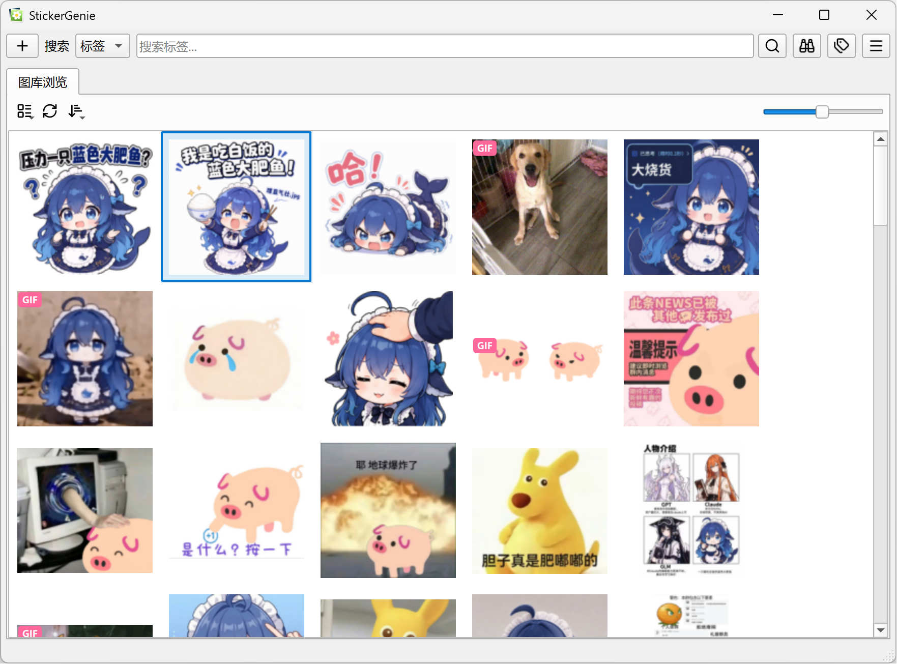

# StickerGenie
一个表情包管理器

# 简介
本项目是基于Python+PyQt6开发的图片管理器，设计用于管理海量表情包并方便复制到社交网络。

核心功能是图片标签管理和相似图片查找。

针对GIF图片做了优化，可以粘贴动图到QQ。

使用的SigLIP模型效果拔群，可以有效识别同一角色的不同形态。

## 屏幕截图

## 功能列表
- 基于标签的图片管理及搜索
- 基于向量余弦相似度的相似图片搜索
- 图片中文本搜索
- 图库导入与导出

若想深入了解，请阅读[详细功能介绍文档](docs/feature_details.md)

## 开发本项目的契机

看看我写这个项目的想法来源

曾经我用qq的表情功能，但界面太小了不够用。

然后我用资源管理器看图，但图太多了。

或许给每张图片妥善命名是个可行的方案，但每次想一个命名我就要花很久，没有耐心去写。

现在我的图已经多到资源管理器会卡，我也几乎没办法整理海量不同主题、不同年份的图了。

有些时候会怎么都找不到特定主题的图或者包含特定文字的图。

现在，你应该能看出来这些痛点和这个软件的功能有什么联系了。

分别是大图库的流畅加载、标签和相似图片查找功能、文字查找功能。

在放了近两年鸽子几乎没动进度之后，我不得不承认自己实在没空亲自手写完这个项目。因此，在模型能力和性价比超越我的预期之后，我决定vibe完这个项目。

### 技术选型理由

#### PyQt6
其实我承认ai非常适合写electron。但是electron这个框架本身太重了。对于桌面端应用程序，我还是想用一些比较原生的东西。在python生态中，pyqt/pyside算是最完整的ui框架了。

由于我之前写过的其他项目的原因，我认为pyqt6具备的在运行时导入ui文件的功能非常有用，因此选的pyqt6而不是pyside6。

尽管如此，好像由于我在内存里缓存了很多解码后的图片，实际内存占用并没有比electron低多少……

#### 没有支持CUDA
release版本里都是只支持cpu推理的。但项目实际上已经准备好了cuda支持，您只需将onnxruntime换成支持cuda的版本并装好对应的cuda依赖，之后取消注释spec文件里面cuda相关的内容就行了。

由于cuda库比程序的其他部分加起来都大，最终打包大小实在让人难以接受，我就放弃了。而且ocr和向量生成都是离线工作，您可以考虑在吃饭或者睡觉的时候挂个机，就能跑完了。

#### 使用siglip模型
最初gemini推荐过最早的那种ViT-B模型，其实效果还不错，但是面对同一角色由不同画师创作的图，还是力不从心。

还试过了其他的一些模型，其中dinov2曾寄于重望，但这个模型似乎不是很适配这个需求，表现不好，ai给出的解释是dinov2似乎更关注图形轮廓，我也认为这个可以解释实际效果，比如不同角色的同一姿势，在相似度上就有更高的分数。

最终试到了siglip模型，效果最好。

其他的一些转换脚本可以在src/misc目录找到。

### 碎碎念
这个仓库的代码生成含量高达95%，不过所有的功能代码我都审过了。我也深入用了一段时间，确定完成度还可以。

为了避免它和最近新出的很多repo一样变成纯ai无人工，我是完全手敲这篇readme的。

或许，在这个ai写代码比大多数人更快也有时更好的时代，相比ai生成的代码，写这个软件的过程和思路是更有价值的东西。

曾经我也希望对一个计划长期支持的项目秉承匠人精神，但ai编程的迅猛发展，dsv4flash涨价前近乎免费的价格和基本满足需求的表现，让我知道，属于匠人的时代已经过去了。人类迎来的，是工业代码。

# 下载与运行

预编译的压缩包可从[releases](https://github.com/Craftkuro/StickerGenie/releases)获取，文件体积巨大是因为包含了模型。

本程序以便携软件的形式运行，因此解压即可使用，无需安装，但需要确保程序所在目录可写，图库也默认存在此处。

由于CUDA库的体积过于巨大，本程序目前只支持CPU模型推理。

在最高强度使用的情况下，主界面需要500M内存，OCR和向量生成模块（按需运行）需要约1GB内存。

# 构建方式

本项目使用Python 3.13。本地构建只需按requirements.txt安装依赖，然后激活虚拟环境，在虚拟环境内以项目根目录为工作路径，运行build.bat即可。

# 后续维护与协作开发
我目前没有关于新功能的计划，在1.0发布的时候，我能想到的所有需求都做完了，我其实是想把它作为finished software一直用到它不再兼容未来的系统为止的。

由于笔者真的很忙，应该没法及时去看issues和pr，因此，如果遇到问题，敬请fork之后让ai修。尽管如此，我也会时不时来看看有没有反馈。

由于ai时不时会雷霆大改架构，大家互相用ai改很容易出大冲突，我不知道能不能接的动pr。

# 引用与致谢
本项目所用图标来自[Lucide Icons](https://lucide.dev/)

本项目的向量生成模型使用了Google发布的[siglip-base-patch16-224](https://huggingface.co/google/siglip-base-patch16-224)，并转换成了onnxruntime兼容的格式。

本项目的OCR模型使用了百度发布的[PP-OCRv6](https://www.paddleocr.ai/main/version3.x/algorithm/PP-OCRv6/PP-OCRv6.html), 模型文件使用了[RapidOCR](https://github.com/RapidAI/RapidOCR)在pypi发布的软件包内置的onnx模型，未做修改。

本项目内置的OCR引擎借鉴了[RapidOCR](https://github.com/RapidAI/RapidOCR)进行开发，精简了运行流程并减少软件包依赖，只实现了本项目所用到的功能。

为了方便构建和下载，本项目使用的模型存放在[https://github.com/Craftkuro/StickerGenie-models](https://github.com/Craftkuro/StickerGenie-models)，模型版权归原作者所有，按原项目的许可证进行分发。

# 领衔主演
模型也要上台！
按使用量估算进行排名。

DeepSeek-v4-flash（涨价前）

GLM-5.3-Flash

GPT-5.6-Luna

GPT-5.6-Sol

Kimi-K2.7

GLM-5.2

