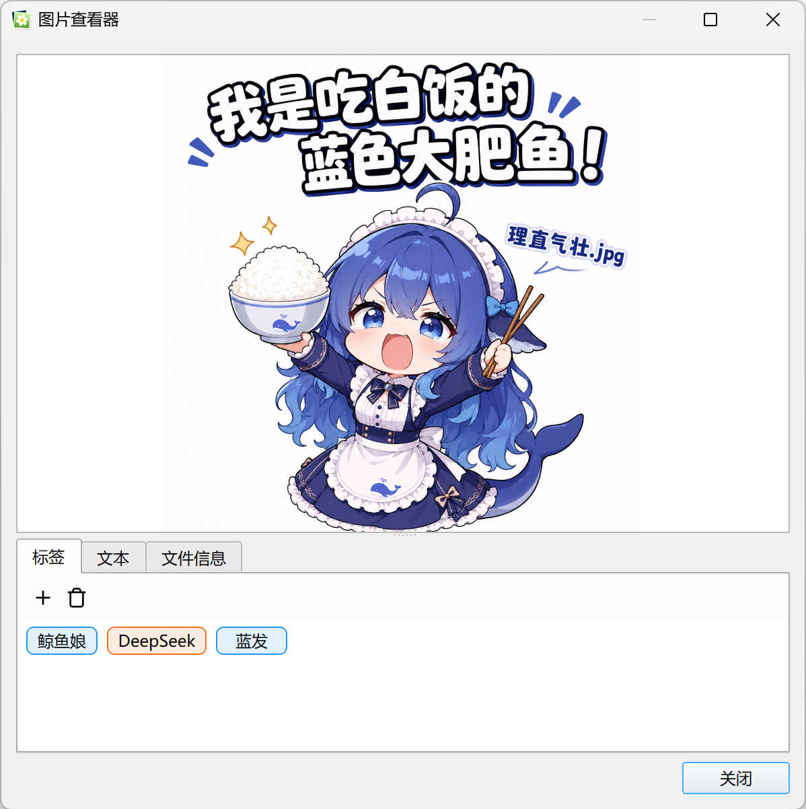
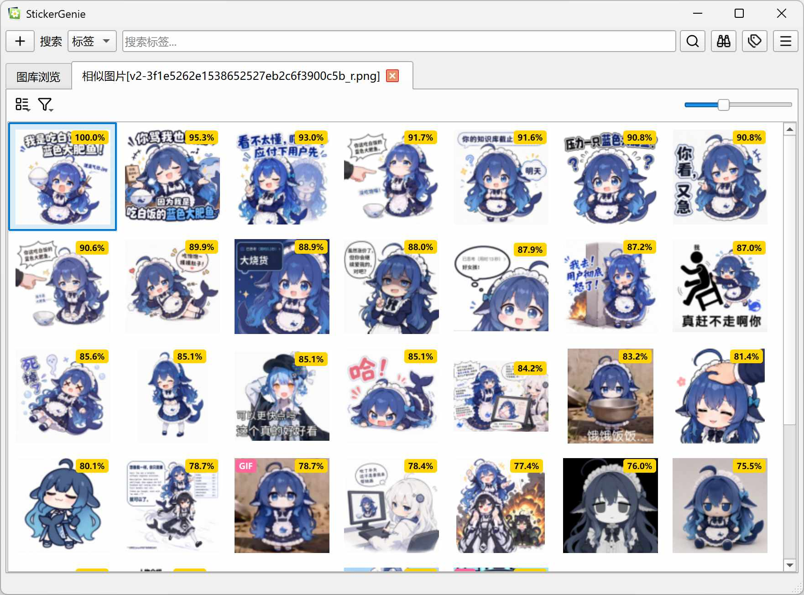
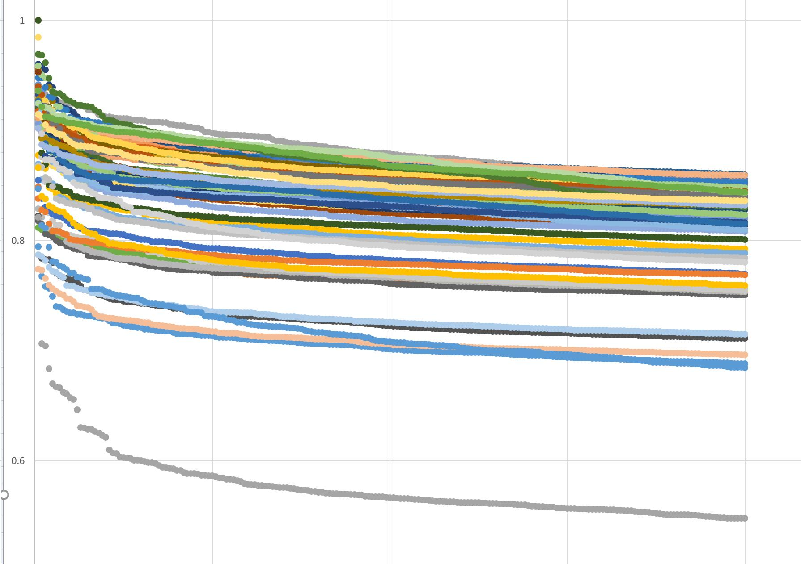
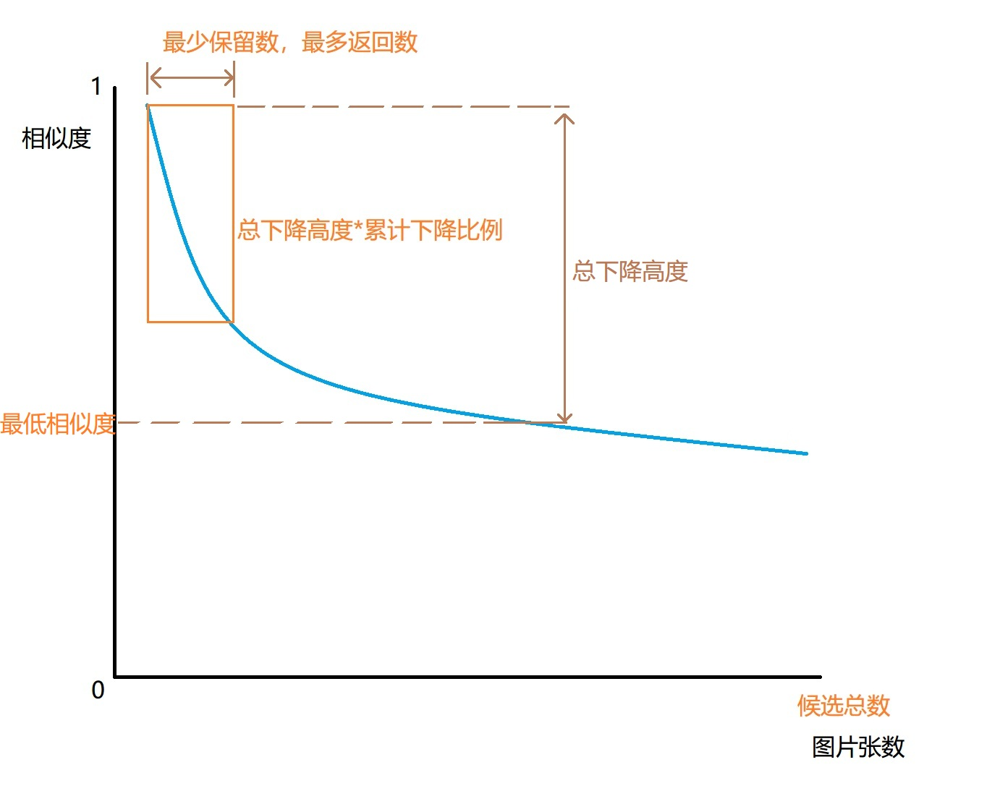
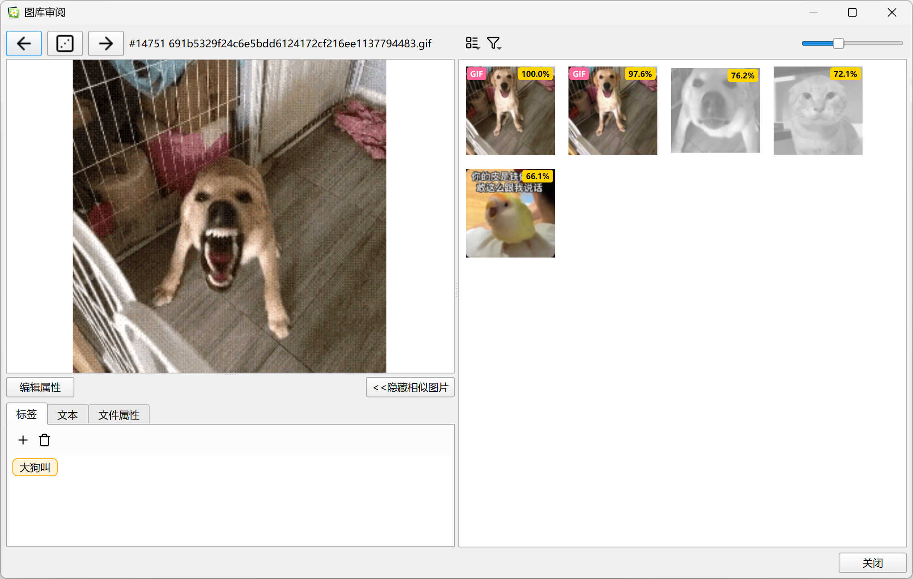

本文档会详细介绍本程序的各种功能。

## 整体设计思路

由于ai尤其是gpt-5.6-sol实在太会添油加醋，因此我特地在agents.md里面写明了数据完整性要求。
总体来说所有功能都会为了降低设计复杂度做一定妥协。

## 图片标签及管理

本项目使用了基于标签的管理机制，本质上是数据库多对多。您可以在图片展示界面和图片查看器、图片审阅界面，增加和删除所选图片关联到的标签。支持多选。

标签关联的界面也可新建标签，但是标签的编辑和删除需要到标签管理器进行。

## 标签颜色预设

借鉴danbooru的标签颜色机制，不同类型的标签可以有不同的颜色。但是这个和标签本身我做成了弱关联，标签并不必须使用预设里面的颜色。

## GIF复制

由于qq需要使用特殊的剪贴板信息来粘贴动图，因此我对gif图片复制做了优化，此时可以粘贴到qq，但是这样画图又粘不进去了。

因此gif图片还有一个单独的复制首帧的菜单项，用于将第一帧复制到其他应用程序。这个实际上是走了普通的复制图片code path，因此复制首帧的同时，也复制了文件，可以在资源管理器粘贴。

详见experiments/copy_image_to_clipboard.py。

## 其他剪贴板行为

复制图片时允许直接将图片粘贴到资源管理器，但是不保留原名。支持多选。

## 标签搜索与高级搜索

您可以在搜索框左边的下拉菜单选择搜索类型，包含四种：标签，文本，原名，高级

普通的标签搜索和你想的一样，对单个标签进行查找，获得所有具备该标签的图片。

在搜索框键入后，即使没有输入完全，敲回车时也会使用候选项中的第一个发起搜索。如果手动点击搜索按钮，就会首先查询所有包含当前词的标签，然后输出所有包含该词的标签的图片的并集。

高级搜索允许使用表达式，表达式语法基于boolean.py，可以使用诸如AND, OR, NOT的表达式，支持括号。我没有重新设计表达式语法，因此可以参照boolean.py的文档写表达式。

高级搜索模式下不支持补全，表达式大小写敏感。

## 文本搜索与原名搜索

文本搜索就是搜索整个库里文本字段，使用子字符串匹配。用于在想不起来标签也找不到相似图片的情况下，找到你想要的那张有字的表情包。

pp-ocr的效果还不错，大部分情况下无需手工重新标注文本信息。

原名搜索顾名思义，就是搜索导入时的文件名，也是子字符串匹配。不过我手上的图片往往文件名没什么意义，因此这个功能我用的很少。

这两个都是用的数据库LIKE，没有加更多优化，但应该用的不是很频繁，图库应该也不会大到那种程度。

## 查找相似图片

选中一张图片，右键菜单点击"查找相似图片"即可打开查找相似图片的新标签页。

### 过滤机制解释

对于典型的图库搜索结果，一般会有一部分图片和原图明显相似，剩下的图片和原图的相似度要明显更低。

以下是我对我的图库中抽选200张图片的相似度作图：

显然你能够发现，我们应当选择靠左上的一部分数据。

但是，针对不同的图片，由于客观上的相似图片数量差异，我们无法给出一个很确定的值，因此我和ai一起确定了一个过滤方案：

首先丢弃所有低于最低相似度的结果。默认0.5，低于此的几乎确实不相关。
令剩余数据集中的第一张到最后一张的相似度的差为总下降高度，然后取其中较高的一部分（默认50%）为输出结果。

这在近一半的情况下能获得较好的结果。

然后对于相似图片过少或过多的情况，对返回图片数量进行钳位，即最少保留数与最多返回数。

这套方案的局限性：

目前为了技术方案简单，只使用了单模型+仅向量的形式，获取不了更多信息，因此只能使用这样一个效果一般的过滤算法。但是，你可以随时关闭这个过滤，并查看向量数据库查询出来的所有候选。

不同的模型的向量相似度分布会有很大差异，目前的采样数据是使用siglip模型的。

## 图库导入

这个功能原计划是备份恢复，但为了避免未经确认的删除，我实际做成了图库合并功能--毕竟多合并几次并没有什么副作用。

具体行为就是把导入的图片和现有的图库进行合并，图片和标签已经有的就忽略。

由于我提供了JSON Schema，理论上你也可以把各种booru下下来的图片和标签，转成兼容的格式后进行导入。不过我没实践过。

## 图库导出

没有什么软件是永恒的，但您的图库是永恒的。为了确保您对您的数据有完全的访问权，本程序提供了图库导出的功能，并提供了JSON Schema。

或许你可以在现在或者未来，写一个其他的软件导入这个图库备份，这样数据还是你的。

即使您不写任何软件，也可以访问备份的内容，我特意采用纯文本格式来存储备份信息。

## 图库审阅

本质上是将一个图片查看器和一个相似图片搜索拼在一起。

你可以在闲时随机浏览图片，并查看它们是否已经被打上了合适的标签。如果没有，使用标签管理器编辑标签，并且通过相似图片查找，对其他适合的图片也一起编辑标签。

## 图片删除

我知道大家一般不会轻易删除自己收集的表情包。因此图片删除功能也只是"移动到图库回收站"。

回收站的位置在图库的recycler目录下。删除时也会存一个图片的元数据文件，包含标签和文本数据。

由于删除需要确认，我相信你需要删除的图片都真的需要删除，因此没有写专门的回收站恢复功能。不过你可以手动加回这些已被删除的图片，并手动编辑上图片属性。

确定不需要的图片，记得事后访问回收站目录手动清理。

