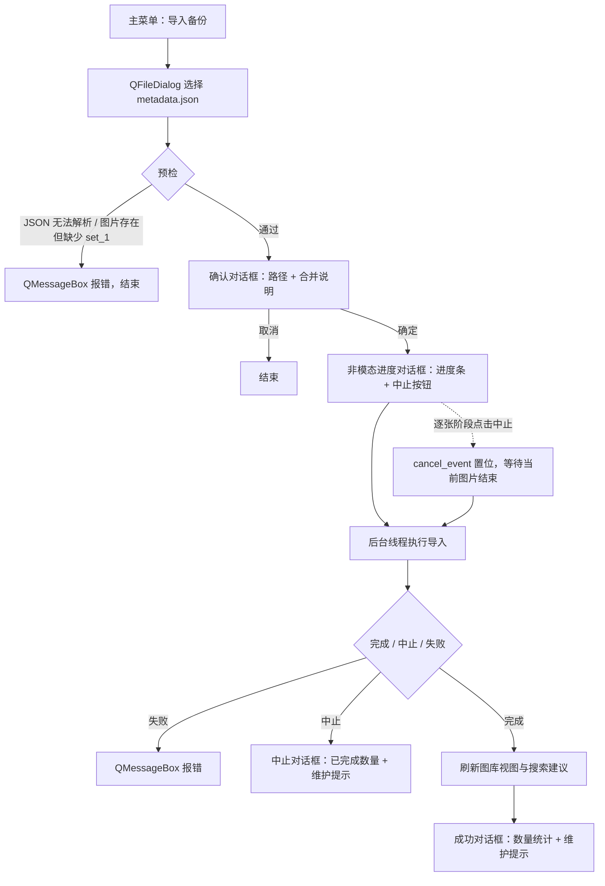

# 图库备份导入功能设计方案

状态：已实现

日期：2026-08-16

## 1. 目标与范围

在现有图库导出（`metadata.json` + `set_N/` 图片目录）的基础上新增“导入图库备份”功能：

- 从主菜单 `导入备份`（`actionImportRepoBackup`）进入，选择 `metadata.json`；
- 把备份标签和图片合并进当前图库；
- 现存的同名标签不被修改，只插入当前图库没有的标签；
- 图片按 hash 合并：图库中没有的完整加入，已有的只合并标签；
- 导入过程不做 OCR、不重建向量库，完成后提示用户去数据库维护里补做；
- 支持协作式取消：只在逐张处理图片的阶段允许取消，任意取消点都不会留下不完整的数据库记录，中断产生的孤立 blob 由维护清理。

本轮按本方案完成实现，代码与测试均已落地。

## 2. 现状梳理

与导入直接相关的现有代码：

| 内容 | 位置 | 说明 |
| --- | --- | --- |
| 菜单动作 | `src/ui/main_window.ui` | `actionImportRepoBackup`（文案“导入备份”）已存在但未接线 |
| 主窗口 | `src/ui/main_window.py` | 导出流程、后台服务、状态栏进度、完成弹窗都可参照 |
| 导出格式 | `src/services/export_library.py` | `metadata.json` 的字段与 `METADATA_SCHEMA` 定义 |
| SQLite 层 | `src/stickerdb/v1/sticker_db.py` | 有 `add_stickers`、`get_existing_sticker_hashes`、`list_tags` 等 |
| Blob 存储 | `src/blob_storage/blob_storage.py` | `store_file` 按 hash 去重，可放心重复调用 |
| 图片元数据 | `src/utils/image_metadata.py` | `get_image_metadata` 一次读出 hash、大小、尺寸、扩展名 |
| 后台任务 | `src/services/export_library.py` | `LibraryExportService` 的 QThread 模式可直接仿照 |

`metadata.json` 中一张图片的字段为：`path`、`hash`、`imported_at`、`modification_date`、`tags`、`text_in_image`。

## 3. 用户流程



选择文件后的“预检”只做两件事：

1. 用 UTF-8 读取并解析 `metadata.json`；
2. 当备份里图片数量 ≥ 1，但 `metadata.json` 所在目录下没有 `set_1` 目录时，弹窗报错。

没有图片但有标签（或只是空备份）时继续进入确认对话框。

> 已确认：set_1 检查条件为“images 数量 ≥ 1 且缺少 set_1 目录”，即只要有图片就要求 set_1 存在。

## 4. 模块划分

为保持与导出一致，核心逻辑和 Qt 后台服务放在同一个新文件：

- 新增 `src/services/import_library.py`：同步核心函数、数据类、异常、`LibraryImportService`；
- 新增 `src/ui/dialog_library_import_progress.py` 与 `src/ui/dialog_library_import_progress.ui`：非模态进度对话框（进度、状态、中止按钮）；
- 修改 `src/stickerdb/v1/sticker_db.py`：新增两个小方法；
- 修改 `src/ui/main_window.py`：接线、预检、确认框、进度与结果弹窗、互斥处理；
- `src/ui/main_window.ui` 不需要改，直接使用已有的 `actionImportRepoBackup`。

预检报错、确认、成功、失败都用 `QMessageBox`；仅进度对话框需要一个新的 `.ui`。

## 5. 核心同步函数

在 `src/services/import_library.py` 中提供：

```python
def import_library(
    database: StickerDBV1,
    blob_storage: BlobStorage,
    metadata_path: str | Path,
    *,
    progress: ProgressCallback | None = None,
    cancel_event: threading.Event | None = None,
) -> LibraryImportResult:
    ...
```

处理步骤如下：

### 5.1 读取与校验 metadata

- 按 UTF-8 读取 JSON；
- 校验 `format_version == 1`、`hash_algorithm == "sha1"`，`images`、`tags` 为数组；
- 每条图片校验 `path` 匹配 `^set_[1-9][0-9]*/[^/\\]+$`，且文件名不是 `.` 或 `..`；
- `hash` 匹配 40 位十六进制并统一转小写；
- `imported_at`、`modification_date` 用 `datetime.datetime.fromisoformat` 解析（Python 3.13 已支持 `Z` 后缀）。

校验失败抛 `LibraryImportError`，由 UI 层显示“导入失败”。

时间往返处理：导出时把 naive 本地时间 `astimezone()` 后写出。导入时对带时区的值执行：

```python
parsed = parsed.astimezone().replace(tzinfo=None)
```

这样能还原出导出前的 naive 本地时间，与现有 SQLite `DateTime` 列的写法一致。

### 5.2 目录布局检查

- 备份根目录 = `metadata.json` 所在目录；
- 图片数量 ≥ 1 时要求 `set_1` 目录存在（与 UI 预检同一条规则，防御性重复检查）；
- 其他 `set_N` 目录不做全量预检；个别图片文件缺失时按“损坏”计数，不中断整体导入。

### 5.3 合并标签

- 把 `tags` 数组解析成 `Tag` DTO（`id=None`，保留 name/rgb/order/description/enabled）；
- 按 name 去重（同名保留第一条）；
- 调 `database.add_missing_tags(tags)` 只插入当前不存在的标签，返回新增数量；
- 再 `database.list_tags()` 得到全部标签，建立 `name -> Tag` 映射供图片使用。

新标签的 `order` 直接采用备份里的值。设计上允许不同标签拥有相同的 order 值，因此 order 与现有标签重复不会破坏数据，只影响 `list_tags` 的显示排序（同 order 按 id 排序，新标签排在同 order 旧标签之后）。

### 5.4 逐张处理图片

先对 `images` 按 hash 去重：同一 hash 的多条记录合并它们的标签集合，避免重复处理和重复计数。

这一阶段是唯一允许取消的阶段。`cancel_event` 在以下位置检查：

- 每张图片开始处理前；
- `store_file` 完成、SQLite 写入开始前。

置位后停止处理后续图片，已提交的图片和标签全部保留，返回 `cancelled=True` 的结果。

对每张图片：

1. `source = backup_root / PurePosixPath(path)`，校验路径落在备份根目录内；
2. `file_metadata = get_image_metadata(source)`，得到实际 hash、大小、尺寸、扩展名；
3. 实际 hash 与 metadata hash 不一致，或文件不存在/无法读取 → `damaged_count += 1`，记录错误后跳过；
4. `blob_storage.store_file(str(source), file_metadata.hash)`。`store_file` 已按 hash 去重，不需要先检查 blob 是否存在，可直接无脑复制；
5. 用 `file_metadata` 和 metadata 构造 `StickerImage`：

   - `original_file_name`：备份文件名；
   - `relative_path`：备份文件的绝对路径（与图片导入 `import_images.py` 的写法一致）；
   - `file_size`、`extension`、`size_width/height`：来自 `get_image_metadata`；
   - `imported_at`、`modification_date`：来自 metadata；
   - `vectordb_id = None`、`text_in_image`：直接用 metadata 里的值；
   - `tags`：把 metadata 的标签名映射为第 5.3 步查到的 `Tag`；查不到的名字跳过并记一条 warning（不自动创建）。

6. 图片入库前先用 `database.get_existing_sticker_hashes(...)` 对全部计划 hash 做一次批量查询，之后：

   - hash 不存在：`inserted = database.add_stickers([sticker])`，插入成功计“新增图片”；若因并发被跳过，则转下面的合并逻辑；
   - hash 已存在：`merged = database.merge_sticker_tags(sticker.hash, sticker.tags)`，本次新增关联数 > 0 时计“合并标签图片”。

7. 按 `completed/total` 上报进度（状态文案：正在导入备份图片，最后文件名可选）。

单张图片严格按“先复制 blob，再写 SQLite”的顺序执行，且 SQLite 写入是单个事务，要么提交、要么回滚。因此协作式取消或进程在任意位置被终止，最多只会多出一个未引用的 blob，不会出现“数据库引用了半成品文件”或“图片记录只写了一半”的情况；孤立 blob 交给现有的“删除未引用 Blob”维护清理。

### 5.5 进度与结果

```python
@dataclass(frozen=True)
class LibraryImportProgress:
    percent: int
    status: str
    completed: int = 0
    total: int = 0
    last_file_name: str | None = None
    cancellable: bool = False
```

逐张处理阶段上报的进度 `cancellable=True`，读取校验与标签合并阶段为 `False`，UI 据此启用/禁用中止按钮。

```python
@dataclass(frozen=True)
class LibraryImportResult:
    metadata_path: str
    added_image_count: int
    merged_tag_image_count: int
    added_tag_count: int
    damaged_count: int
    errors: tuple[str, ...]
    cancelled: bool = False
```

不执行 OCR、不生成向量、不重建缩略图。新图片的 `text_in_image` 使用备份值，向量留空，由数据库维护补做。

## 6. 数据库新增方法

在 `StickerDBV1` 增加两个方法，保持现有“一个 session 一个事务”的风格：

### 6.1 `add_missing_tags`

```python
def add_missing_tags(self, tags: List[Tag]) -> int:
    """只插入当前不存在的同名标签，返回实际新增数量；已存在的完全不改。"""
    with self._write_lock, self._get_session() as session:
        existing_names = set(
            session.execute(select(DBTag.name)).scalars()
        )
        added = 0
        seen = set(existing_names)
        for dto in tags:
            if dto.name in seen:
                continue
            seen.add(dto.name)
            session.add(self._import_tag(dto))
            added += 1
        session.commit()
        return added
```

注意不能复用 `add_or_modify_tag`：它在 name 已存在时会覆盖属性，违反“现存同名标签不修改”。

### 6.2 `merge_sticker_tags`

```python
def merge_sticker_tags(self, sticker_hash: str, tags: List[Tag]) -> int:
    """按 hash 查找图片，合并标签关联（并集去重），返回新增的关联数。"""
    ...
```

实现要点：

- 在 `_write_lock` + session 中按 `hash` 查 `DBStickerImage`；
- 已有关联 tag id 做集合，只追加不在集合中的 `Tag`（`Tag.id` 必须来自 `list_tags()` 结果）；
- 不存在的 hash 返回 0，由调用方决定是否按新增处理；
- 不修改图片其他字段，也不修改标签属性。

## 7. Qt 后台服务

在 `import_library.py` 内提供 `LibraryImportService(BackgroundJobService)`，仿照 `DatabaseMaintenanceService` 处理取消：

- `import_finished = pyqtSignal(object)`；
- `import_cancelled = pyqtSignal(object)`；
- `import_failed = pyqtSignal(str)`；
- `import_progress_changed = pyqtSignal(object)`；
- `start_import(metadata_path)` 从 `services.global_instances` 取当前 `current_library_db` 和 `current_blob_storage`，未初始化时报错；
- 同一时间只允许一个导入任务，任务未结束再次调用直接抛错；
- `start()` 时传入 `cancel_allowed=lambda progress: bool(getattr(progress, "cancellable", False))`，由最新进度控制是否可以取消；
- `cancel_import() -> bool` 转调 `self.cancel()`，底层用 `threading.Event` 协作式取消。

## 8. UI 集成

在 `src/ui/main_window.py`：

1. 构造函数里创建 `LibraryImportService` 并连接完成/中止/失败/进度四个信号；
2. `setup_base_slots` 中：

   ```python
   self.actionImportRepoBackup.triggered.connect(self.import_library_backup)
   ```

3. 新增 `import_library_backup()`：

   - `QFileDialog.getOpenFileName`，过滤器默认 `metadata.json (metadata.json)`；
   - 取消选择直接返回；
   - 调 `import_library.preflight(metadata_path)` 做第 3 节的预检，异常弹 `QMessageBox.critical`；
   - 确认框（`QMessageBox.question`，Yes/No）：

     - 标题：导入图库备份
     - 正文：`已选择备份文件：\n{绝对路径}`
     - `setInformativeText`：`所选图库备份将和当前图库合并，现存的同名标签不会被修改。如果希望完全覆盖当前图库，请先退出本程序并删除当前图库，再启动本程序并重试导入。`

   - 确认后禁用写操作入口，打开非模态 `LibraryImportProgressDialog`，状态栏显示“正在导入图库备份…”，调 `start_import`；

4. 进度对话框：

   - 展示 `status`、`completed/total` 和进度条；
   - `progress.cancellable` 为 `True` 时启用“中止”按钮，其余阶段禁用；
   - 点击中止后按钮立即禁用、状态显示“正在中止”，并把 `cancel_requested` 转给 `service.cancel_import()`；
   - 运行期间禁止用户手动关闭，任务进入终态后由主窗口调用 `finish()` 自动关闭；
   - 主窗口状态栏同步显示 `status（completed/total）`。

5. 完成槽：

   - 恢复写操作入口；
   - 有新增图片或合并标签时调 `services.sticker_library_viewer_service.wiring.slot_refresh_content()`；
   - 有新增标签时调 `self.customSearchBox.refresh_suggestions()`；
   - 成功对话框：

     ```text
     导入完成，新增图片 X 张，为 Y 张已有图片合并标签，新增标签 Z 个。

     为了实现完整的搜索功能，请在数据库维护功能里按需重新进行OCR和生成图片特征索引。
     ```

     （损坏数量 > 0 时并入统计文案；最后一句为固定文案。）

   - `errors` 非空时再弹 warning，展示前 10 条损坏明细；

6. 中止槽：

   - 恢复写操作入口、关闭进度对话框；
   - 已有新增图片或合并标签时刷新图库视图，有新增标签时刷新搜索建议；
   - `QMessageBox.information` 展示“导入已中止”和已完成数量，并提示孤立 blob 可通过数据库维护清理、新导入图片仍需在维护里补做 OCR 和特征索引。

7. 失败槽：恢复写操作入口、关闭进度对话框、清状态栏、`QMessageBox.critical`。

### 8.1 与维护/其他导入的互斥

备份导入是非模态的后台任务，为避免与数据库维护、图片导入、导出并发写 SQLite，导入运行期间禁用：

- `actionImportRepoBackup`
- `actionImportImages`
- `actionExportLibrary`
- `actionStartDatabaseMaintenance`
- `pushButtonAddSticker`

终态（完成/中止/失败）统一恢复。维护对话框本身是模态的，天然挡住主菜单，因此无需扩展维护侧；若后续把维护改成非模态，再对称禁用 `actionImportRepoBackup`。

## 9. 错误与边界情况

| 情况 | 行为 |
| --- | --- |
| metadata.json 不存在/不是合法 JSON | 预检报错，不进入确认框 |
| format_version / hash_algorithm 不支持 | `LibraryImportError`，弹“导入失败” |
| 有图片但缺少 set_1 | 预检报错 |
| 图片文件缺失 / 无法读取 / hash 不一致 | 计损坏数量，跳过该张，继续导入 |
| metadata 里图片 hash 重复 | 去重后合并标签集合 |
| metadata 里标签 name 重复 | 按 name 去重，保留第一条 |
| 图片引用了 metadata 之外的标签名 | 跳过该标签并记 warning，不自动创建 |
| 目标图库已有同 hash 图片 | 只合并标签，其他字段不动 |
| 只有标签、没有图片 | 正常导入标签，成功对话框图片数为 0 |
| 空备份（无图无标签） | 正常结束，统计全为 0 |
| 图库未初始化 | 服务启动前报错 |
| 逐张阶段点击中止 | 当前图片处理完后停止，已提交数据保留，返回 `cancelled=True` |
| 读取校验 / 标签合并阶段 | 中止按钮禁用，这两个阶段本身是纯读或单个事务 |
| 复制中途进程被终止 | 最多留下未引用 blob；SQLite 事务原子回滚；维护可清理 |

数据完整性目标：SQLite 部分保证正确。取消点只放在单张图片的原子边界，且单张图片固定“先复制 blob、后写 SQLite”，因此取消或进程终止不会产生半条数据库记录；多余的孤立 blob 交给现有“删除未引用 Blob”维护功能清理，不做复杂回滚。

## 10. 测试计划

新增 `tests/test_import_library.py`，用 `tempfile` + 真实 `StickerDBV1`/`BlobStorage` 覆盖核心逻辑：

1. 空图库导入标准备份：图片、标签、属性、`text_in_image` 全部落库；
2. 已存在同 hash 图片：不重复插入，只合并新标签，其他字段不变；
3. 已存在同名标签：属性（颜色、描述、启用状态、顺序）不被覆盖；
4. 缺失文件、hash 不一致：计入 damaged，不落库，其余图片正常导入；
5. 只有 tags、无 images 的备份可导入；
6. 有 images 但缺 set_1：核心函数抛错（及 UI 预检拦截）；
7. format_version、hash_algorithm 非法：报错；
8. 图片 hash 重复、标签 name 重复：正确去重合并；
9. 时间字段带时区/`Z` 后缀：往返还原为本地 naive 时间；
10. 逐张阶段置位 `cancel_event`：已处理图片保留、后续图片跳过、`cancelled=True`，且数据库无半条记录；
11. 在复制完成、DB 写入前取消：最多多出一个未引用 blob，DB 引用与 blob 内容仍一致；
12. `add_missing_tags` 与 `merge_sticker_tags` 的单测（并集、去重、不修改已有属性）。

UI 层仿 `tests/test_main_window_library_export.py` 增加 `tests/test_main_window_library_import.py`：

- 触发菜单 → 文件选择被取消时无事发生；
- 预检失败弹报错框；
- 确认框显示路径与固定说明文案，取消不启动任务；
- 确认后走后台线程，完成后显示统计与固定维护提示；
- 中止按钮只在 `cancellable=True` 的逐张阶段可用，点击后等待当前图片结束并显示中止文案；
- 进度对话框运行中不可手动关闭，终态自动关闭；
- 失败时显示错误框；
- 导入期间冲突入口被禁用，终态恢复。

## 11. 已确认的取舍

1. **relative_path**：新图片记录为备份文件的绝对路径，与图片导入 `import_images.py` 的写法一致。
2. **图片引用未知标签名**：跳过并记 warning，不自动创建标签。
3. **确认框默认按钮**：默认选中“取消”，避免误触发批量写入。
