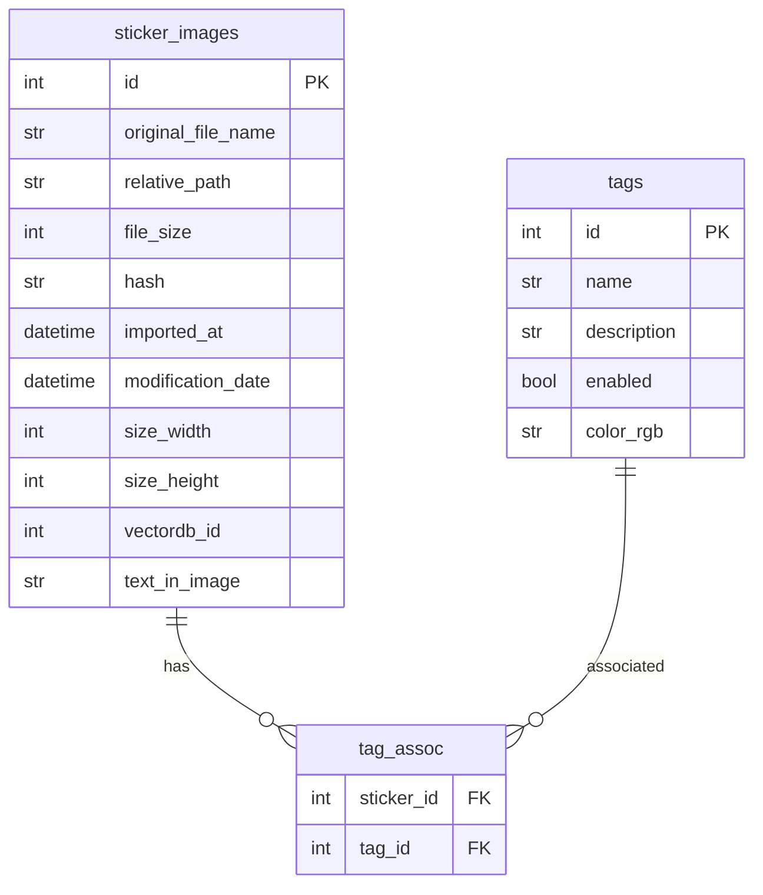

# StickerDB V1 设计文档

## 概述

本模块是一个基于 SQLite 和 SQLAlchemy ORM 的表情包数据库管理模块，位于 `src/stickerdb/v1`。

## 文件结构

```
src/stickerdb/v1/
├── __init__.py          # 模块初始化，导出 StickerDBV1
├── db_classes.py        # ORM 模型类定义
└── sticker_db.py        # StickerDBV1 主类实现
```

## 数据库表设计

### 表结构

1. **sticker_images 表** - 存储表情包图片信息
2. **tags 表** - 存储标签信息
3. **tag_assoc 表** - 关联表，处理 sticker 与 tag 的多对多关系

### ER 图



## ORM 模型类设计

### DBStickerImage 类

位于 [`src/stickerdb/v1/db_classes.py`](src/stickerdb/v1/db_classes.py)

| 字段 | 类型 | 说明 |
|------|------|------|
| id | int | 主键，自增 |
| original_file_name | str | 原始文件名 |
| relative_path | str | 相对路径 |
| file_size | int | 文件大小 |
| hash | str | 文件哈希值 |
| imported_at | datetime | 导入时间 |
| modification_date | datetime | 修改日期 |
| size_width | int | 宽度 |
| size_height | int | 高度 |
| vectordb_id | Optional[int] | 向量库 ID |
| text_in_image | str | 图片中的文字 |
| tags | List[DBTag] | 关联的标签（多对多） |

### DBTag 类

位于 [`src/stickerdb/v1/db_classes.py`](src/stickerdb/v1/db_classes.py)

| 字段 | 类型 | 说明 |
|------|------|------|
| id | int | 主键 |
| name | str | 标签名称 |
| description | Optional[str] | 描述 |
| enabled | bool | 是否启用 |
| color_rgb | str | 颜色 RGB 值 |
| stickers | List[DBStickerImage] | 关联的表情包（多对多） |

## StickerDBV1 主类设计

### 构造函数

```python
def __init__(self, db_path: str):
    """
    初始化数据库连接。
    :param db_path: SQLite 数据库文件路径
    """
```

### 对外接口方法

#### 1. list_stickers

```python
def list_stickers(self, order_by: str = 'date', descending: bool = False, 
                  offset: int = 0, count: Optional[int] = None) -> list[StickerImage]:
    """
    按指定的条件列出表情包。
    :param order_by: 排序字段，支持 'imported_at', 'modification_date', 'original_file_name', 'file_size'
    :param descending: 是否降序
    :param offset: 偏移量
    :param count: 返回数量，None 表示返回全部
    :return: StickerImage DTO 列表
    """
```

#### 2. query_by_single_tag

```python
def query_by_single_tag(self, tag: Tag) -> list[StickerImage]:
    """
    根据指定的标签，查找符合条件的表情包。
    目前只支持单个标签的筛选。
    返回的数据按数据库内部顺序，需要在其他模块重新排序。
    :param tag: 标签对象
    :return: StickerImage DTO 列表
    """
```

#### 3. query_by_file_name

```python
def query_by_file_name(self, name: str) -> list[StickerImage]:
    """
    根据指定的文件名（或部分文件名），查找符合条件的表情包。
    使用模糊匹配 (LIKE)。
    返回的数据按数据库内部顺序，需要在其他模块中重新排序。
    :param name: 文件名或文件名片段
    :return: StickerImage DTO 列表
    """
```

#### 4. add_stickers

```python
def add_stickers(self, stickers: list[StickerImage]):
    """
    新增表情包。
    文件名和 hash 无冲突由其他模块保证。
    :param stickers: StickerImage DTO 列表
    """
```

#### 5. modify_stickers

```python
def modify_stickers(self, stickers: List[StickerImage]):
    """
    修改现有表情包。
    根据 StickerImage 实例中包含的 id 来确定需要更新的对象。
    :param stickers: StickerImage DTO 列表
    """
```

#### 6. delete_stickers

```python
def delete_stickers(self, stickers: List[StickerImage]):
    """
    根据输入实例中的 id 删除表情包。
    :param stickers: StickerImage DTO 列表
    """
```

#### 7. add_or_modify_tag

```python
def add_or_modify_tag(self, tag: Tag):
    """
    新增一个标签。
    如果与现有的 id 重复则覆盖其属性，可使用这种方式来实现修改。
    :param tag: Tag DTO 对象
    """
```

#### 8. delete_tag

```python
def delete_tag(self, tag: Tag):
    """
    删除标签。
    对象选择的依据是 tag 的 id。
    也要清除所有与这个 Tag 的关联。
    :param tag: Tag DTO 对象
    """
```

### 内部辅助方法

#### DTO 与 ORM 对象转换

```python
def _export_sticker(self, db_sticker: DBStickerImage) -> StickerImage:
    """
    将 ORM 对象转换为 DTO，避免 session 绑定问题。
    :param db_sticker: DBStickerImage 实例
    :return: StickerImage DTO
    """

def _export_tag(self, db_tag: DBTag) -> Tag:
    """
    将 ORM 对象转换为 DTO。
    :param db_tag: DBTag 实例
    :return: Tag DTO
    """

def _import_sticker(self, dto: StickerImage) -> DBStickerImage:
    """
    将 DTO 转换为 ORM 对象用于新增/修改操作。
    :param dto: StickerImage DTO
    :return: DBStickerImage 实例
    """

def _import_tag(self, dto: Tag) -> DBTag:
    """
    将 DTO 转换为 ORM 对象用于新增/修改操作。
    :param dto: Tag DTO
    :return: DBTag 实例
    """
```

## 实现注意事项

1. **Session 管理**：所有查询方法返回的必须是 DTO 而非 ORM 对象，避免 session 绑定问题。

2. **事务处理**：增删改操作需要使用事务，确保数据一致性。

3. **排序字段映射**：`list_stickers` 方法中的 `order_by` 参数需要映射到实际的列名：
   - `'imported_at'` → `DBStickerImage.imported_at`
   - `'modification_date'` → `DBStickerImage.modification_date`
   - `'original_file_name'` → `DBStickerImage.original_file_name`
   - `'file_size'` → `DBStickerImage.file_size`

4. **模糊匹配**：`query_by_file_name` 使用 `LIKE %name%` 进行模糊匹配。

5. **标签关联处理**：
   - 添加表情包时，需要根据标签名称查找或创建对应的 DBTag
   - 删除标签时，需要清除 tag_assoc 表中的所有关联

## 依赖

- `sqlalchemy` - ORM 框架
- `commons.dto` - DTO 类定义