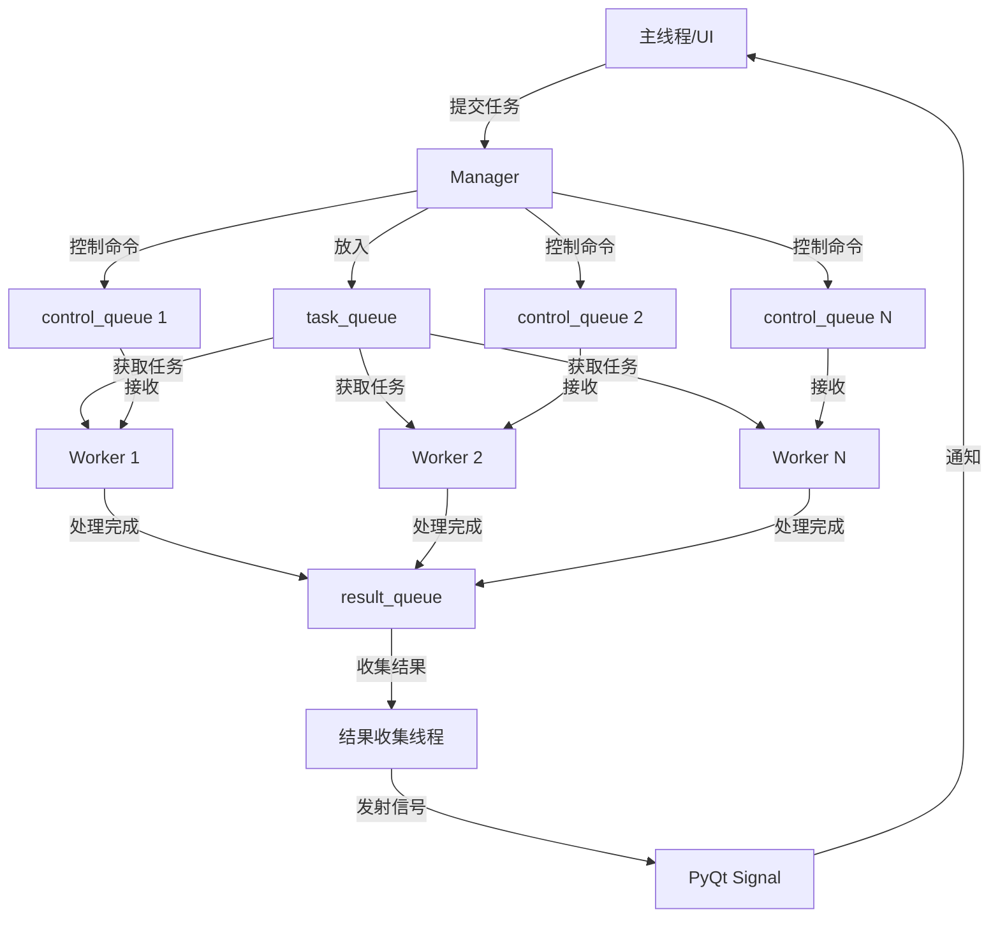
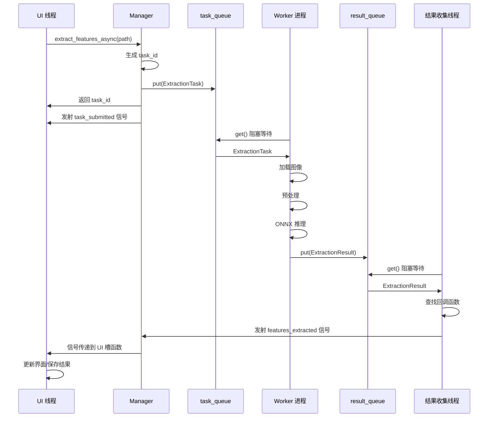
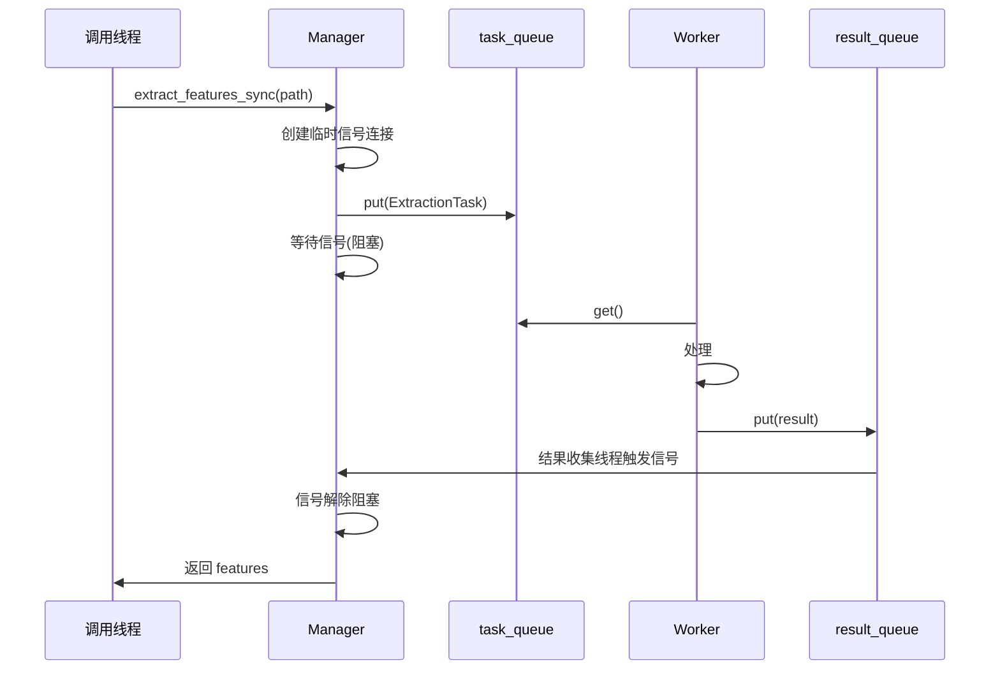
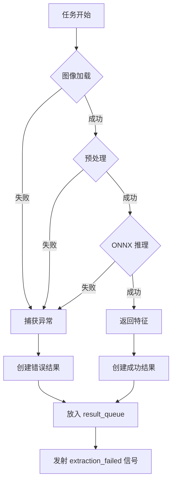

# Image Features Extractor 模块设计文档

## 1. 概述

`image_features_extractor` 模块是 StickerGenie 项目中用于图像特征提取的核心组件。该模块采用多进程架构,将耗时的 ONNX 模型推理任务放在独立的 Worker 进程中执行,通过进程池管理和任务队列实现高效的并发处理,并集成 PyQt6 信号机制提供异步通知能力。

### 1.1 设计目标

- **性能优化**: 利用多进程绕过 Python GIL,充分利用多核 CPU
- **UI 响应性**: 避免阻塞主线程,保持 UI 流畅
- **易用性**: 提供简洁的 API,隐藏复杂的进程管理细节
- **可靠性**: 完善的错误处理和进程生命周期管理
- **可扩展性**: 支持动态调整 Worker 数量,适应不同硬件配置

## 2. 模块结构

### 2.1 文件组织

```
src/image_features_extractor/
├── __init__.py                 # 模块入口,导出公共API
├── DESIGN.md                   # 本设计文档
├── extractor.py                # 主要的 Manager 类
├── worker.py                   # Worker 进程实现
├── signals.py                  # PyQt6 信号定义
├── tasks.py                    # 任务数据类定义
├── config.py                   # 配置常量
└── exceptions.py               # 自定义异常类
```

### 2.2 职责划分

#### `__init__.py`
- 导出 `ImageFeaturesExtractor` 主类
- 导出常用的异常类型
- 提供模块版本信息

#### `extractor.py`
- 实现 `ImageFeaturesExtractor` 管理类
- 负责进程池的创建、启动、停止
- 任务分发和结果收集
- 与主线程的信号交互

#### `worker.py`
- 实现 `FeatureExtractionWorker` 类
- 在独立进程中运行
- 加载和管理 ONNX 模型
- 执行特征提取任务
- 处理异常并返回结果

#### `signals.py`
- 定义 `ExtractorSignals` 类(继承自 `QObject`)
- 声明所有异步通知信号
- 提供类型安全的信号参数

#### `tasks.py`
- 定义 `ExtractionTask` 任务数据类
- 定义 `ExtractionResult` 结果数据类
- 定义 `WorkerCommand` 控制命令枚举

#### `config.py`
- 默认配置参数(Worker 数量、超时时间等)
- 模型相关配置(路径、输入尺寸等)

#### `exceptions.py`
- `ExtractorError`: 基础异常类
- `ModelLoadError`: 模型加载失败
- `WorkerStartupError`: Worker 启动失败
- `ExtractionError`: 特征提取失败
- `QueueFullError`: 任务队列已满

## 3. 核心组件设计

### 3.1 Worker 进程 (`worker.py`)

#### 职责
- 独立进程中运行,避免 GIL 影响
- 初始化时加载 ONNX 模型(一次性开销)
- 从任务队列获取任务
- 执行图像预处理和特征提取
- 将结果放入结果队列
- 监听控制命令(停止、健康检查等)

#### 核心类设计

```python
class FeatureExtractionWorker:
    """
    Worker 进程类,负责实际的特征提取工作
    """
    def __init__(self, 
                 worker_id: int,
                 model_path: str,
                 task_queue: multiprocessing.Queue,
                 result_queue: multiprocessing.Queue,
                 control_queue: multiprocessing.Queue):
        """
        参数:
            worker_id: Worker 唯一标识
            model_path: ONNX 模型文件路径
            task_queue: 接收任务的队列
            result_queue: 发送结果的队列
            control_queue: 接收控制命令的队列
        """
        
    def _load_model(self) -> None:
        """加载 ONNX 模型和预处理 transforms"""
        
    def _process_image(self, image_path: str) -> np.ndarray:
        """
        处理单张图像
        返回: 特征向量(numpy array)
        抛出: ExtractionError
        """
        
    def run(self) -> None:
        """
        Worker 主循环
        - 持续从 task_queue 获取任务
        - 检查 control_queue 是否有停止命令
        - 执行特征提取
        - 将结果放入 result_queue
        """
```

#### 数据流

```
[Manager] --task--> [task_queue] ---> [Worker.run()]
                                           |
                                           v
                                    [_process_image]
                                           |
                                           v
[Manager] <--result-- [result_queue] <-- [Worker.run()]
```

### 3.2 Manager 类 (`extractor.py`)

#### 职责
- 创建和管理 Worker 进程池
- 提供同步/异步任务提交接口
- 从结果队列收集结果
- 触发 PyQt6 信号通知主线程
- 管理进程生命周期(启动/停止/重启)

#### 核心类设计

```python
class ImageFeaturesExtractor(QObject):
    """
    特征提取管理器,协调多个 Worker 进程
    """
    def __init__(self,
                 num_workers: int = 1,
                 model_path: str = "vit_b_16_features.onnx",
                 max_queue_size: int = 100):
        """
        参数:
            num_workers: Worker 进程数量
            model_path: ONNX 模型路径
            max_queue_size: 任务队列最大长度
        """
        
    def start(self) -> None:
        """
        启动所有 Worker 进程
        抛出: WorkerStartupError
        """
        
    def stop(self, timeout: float = 5.0) -> None:
        """
        优雅地停止所有 Worker
        参数:
            timeout: 等待进程退出的超时时间
        """
        
    def extract_features_async(self,
                               image_path: str,
                               task_id: Optional[str] = None,
                               callback: Optional[Callable] = None) -> str:
        """
        异步提交特征提取任务
        
        参数:
            image_path: 图像文件路径
            task_id: 任务唯一标识(可选,自动生成)
            callback: 完成时的回调函数(可选)
            
        返回: 任务ID
        抛出: QueueFullError
        """
        
    def extract_features_sync(self,
                              image_path: str,
                              timeout: float = 30.0) -> np.ndarray:
        """
        同步提取特征(阻塞直到完成)
        
        参数:
            image_path: 图像文件路径
            timeout: 超时时间(秒)
            
        返回: 特征向量
        抛出: ExtractionError, TimeoutError
        """
        
    def _result_collector_thread(self) -> None:
        """
        结果收集线程,持续从 result_queue 获取结果并触发信号
        """
        
    @property
    def is_running(self) -> bool:
        """检查提取器是否正在运行"""
        
    @property
    def queue_size(self) -> int:
        """获取当前队列中的任务数量"""
```

### 3.3 信号系统 (`signals.py`)

#### 设计原则
- 所有异步通知通过 PyQt6 信号发出
- 信号在主线程中触发,安全更新 UI
- 提供丰富的上下文信息

#### 信号定义

```python
class ExtractorSignals(QObject):
    """
    特征提取器的信号集合
    """
    # 特征提取完成
    # 参数: (task_id: str, image_path: str, features: np.ndarray)
    features_extracted = pyqtSignal(str, str, object)
    
    # 特征提取失败
    # 参数: (task_id: str, image_path: str, error_message: str)
    extraction_failed = pyqtSignal(str, str, str)
    
    # 任务提交成功
    # 参数: (task_id: str, image_path: str)
    task_submitted = pyqtSignal(str, str)
    
    # Worker 启动完成
    # 参数: (worker_id: int)
    worker_started = pyqtSignal(int)
    
    # Worker 停止
    # 参数: (worker_id: int)
    worker_stopped = pyqtSignal(int)
    
    # 进度更新(批量处理时)
    # 参数: (completed: int, total: int)
    progress_updated = pyqtSignal(int, int)
    
    # 所有 Worker 已就绪
    all_workers_ready = pyqtSignal()
```

### 3.4 任务和结果数据类 (`tasks.py`)

```python
from dataclasses import dataclass
from typing import Optional
import numpy as np
from enum import Enum

class TaskStatus(Enum):
    """任务状态枚举"""
    PENDING = "pending"
    PROCESSING = "processing"
    COMPLETED = "completed"
    FAILED = "failed"

@dataclass
class ExtractionTask:
    """特征提取任务"""
    task_id: str
    image_path: str
    timestamp: float  # 提交时间戳
    callback: Optional[Callable] = None
    
@dataclass
class ExtractionResult:
    """特征提取结果"""
    task_id: str
    image_path: str
    features: Optional[np.ndarray]  # None 表示失败
    error_message: Optional[str]
    worker_id: int
    processing_time: float  # 处理耗时(秒)
    
class WorkerCommand(Enum):
    """Worker 控制命令"""
    STOP = "stop"
    HEALTH_CHECK = "health_check"
```

## 4. 进程间通信机制

### 4.1 队列设计

#### 任务队列 (`task_queue`)
- 类型: `multiprocessing.Queue`
- 容量: 可配置(默认 100)
- 数据: `ExtractionTask` 对象
- 生产者: Manager 主线程
- 消费者: 所有 Worker 进程

#### 结果队列 (`result_queue`)
- 类型: `multiprocessing.Queue`
- 容量: 无限制(依赖内存)
- 数据: `ExtractionResult` 对象
- 生产者: 所有 Worker 进程
- 消费者: Manager 结果收集线程

#### 控制队列 (`control_queue`)
- 类型: `multiprocessing.Queue`(每个 Worker 独立)
- 容量: 10(足够控制命令)
- 数据: `WorkerCommand` 枚举
- 生产者: Manager 主线程
- 消费者: 对应的 Worker 进程

### 4.2 通信流程



### 4.3 序列化策略

- **任务对象**: 使用 `pickle` 序列化(Python 标准)
- **NumPy 数组**: 直接序列化(NumPy 原生支持)
- **异常信息**: 转换为字符串传递

### 4.4 超时和重试

- 任务队列放入超时: 5 秒
- 同步提取超时: 可配置(默认 30 秒)
- Worker 停止超时: 5 秒
- 失败任务不自动重试(由上层决定)

## 5. 数据流

### 5.1 异步提取流程



### 5.2 同步提取流程



### 5.3 错误处理流程



## 6. API 设计

### 6.1 基本使用

```python
from image_features_extractor import ImageFeaturesExtractor

# 1. 创建提取器实例
extractor = ImageFeaturesExtractor(
    num_workers=2,  # 2个Worker进程
    model_path="vit_b_16_features.onnx"
)

# 2. 启动Worker进程
extractor.start()

# 3. 连接信号(可选)
extractor.signals.features_extracted.connect(on_features_ready)
extractor.signals.extraction_failed.connect(on_error)

# 4. 提交异步任务
task_id = extractor.extract_features_async(
    image_path="path/to/image.jpg",
    callback=lambda result: print(f"完成: {result.features.shape}")
)

# 5. 或使用同步方式
try:
    features = extractor.extract_features_sync("path/to/image.jpg")
    print(f"特征维度: {features.shape}")
except Exception as e:
    print(f"提取失败: {e}")

# 6. 停止(程序退出前)
extractor.stop()
```

### 6.2 批量处理

```python
from pathlib import Path

# 批量提取特征
image_dir = Path("images/")
results = {}

def on_complete(task_id, image_path, features):
    results[image_path] = features
    print(f"进度: {len(results)}/{total}")

extractor.signals.features_extracted.connect(on_complete)

# 提交所有任务
image_files = list(image_dir.glob("*.jpg"))
total = len(image_files)

for img_path in image_files:
    extractor.extract_features_async(str(img_path))

# 等待所有完成(简单轮询)
import time
while len(results) < total:
    time.sleep(0.1)
    QApplication.processEvents()  # 处理 Qt 事件

print(f"完成 {len(results)} 张图像的特征提取")
```

### 6.3 与现有 ImageSimilarityFinder 集成

```python
from image_similarity import ImageSimilarityFinder
from image_features_extractor import ImageFeaturesExtractor

class AsyncImageSimilarityFinder(ImageSimilarityFinder):
    """
    扩展现有的相似度查找器,支持异步特征提取
    """
    def __init__(self, num_workers=2):
        # 不调用父类 __init__,避免加载模型
        self.extractor = ImageFeaturesExtractor(num_workers=num_workers)
        self.extractor.start()
        
    def create_index_async(self, folder_path, progress_callback=None):
        """异步版本的索引创建"""
        image_files = [...]  # 扫描图像文件
        
        for img_path in image_files:
            self.extractor.extract_features_async(
                img_path,
                callback=lambda result: self._on_feature_extracted(result)
            )
            
    def _on_feature_extracted(self, result):
        """特征提取完成的回调"""
        if result.features is not None:
            self.index[result.image_path] = result.features
        
    def __del__(self):
        self.extractor.stop()
```

### 6.4 上下文管理器支持

```python
from image_features_extractor import ImageFeaturesExtractor

# 使用 with 语句自动管理生命周期
with ImageFeaturesExtractor(num_workers=2) as extractor:
    # 自动调用 start()
    features = extractor.extract_features_sync("image.jpg")
    # 退出时自动调用 stop()
```

## 7. 配置和优化

### 7.1 配置参数 (`config.py`)

```python
# 默认配置
DEFAULT_NUM_WORKERS = 1
DEFAULT_MAX_QUEUE_SIZE = 100
DEFAULT_MODEL_PATH = "vit_b_16_features.onnx"
DEFAULT_SYNC_TIMEOUT = 30.0  # 秒
DEFAULT_SHUTDOWN_TIMEOUT = 5.0  # 秒

# ONNX Runtime 配置
ONNX_PROVIDERS = ['CUDAExecutionProvider', 'CPUExecutionProvider']
ONNX_SESSION_OPTIONS = {
    'graph_optimization_level': ort.GraphOptimizationLevel.ORT_ENABLE_ALL,
    'intra_op_num_threads': 0,  # 由于目前只使用一个worker因此在这里设为0, 使用所有可用处理器
}

# 图像预处理配置
IMAGE_SIZE = (224, 224)
NORMALIZE_MEAN = [0.485, 0.456, 0.406]
NORMALIZE_STD = [0.229, 0.224, 0.225]
```

### 7.2 性能优化建议

#### Worker 数量选择
- **CPU 密集型**: `num_workers = CPU核心数 - 1`
- **I/O 密集型**: `num_workers = CPU核心数 * 2`
- **混合场景**: 根据实际测试调整

#### 内存管理
- 限制队列大小,避免内存溢出
- 及时释放大型 NumPy 数组
- Worker 进程设置内存限制(可选)

#### GPU 加速
- 如果使用 CUDA,每个 Worker 使用独立 GPU 或合理分配
- 设置 `CUDA_VISIBLE_DEVICES` 环境变量
- 考虑使用 TensorRT 优化模型

## 8. 错误处理

### 8.1 异常层次

```python
# exceptions.py

class ExtractorError(Exception):
    """基础异常类"""
    pass

class ModelLoadError(ExtractorError):
    """模型加载失败"""
    pass

class WorkerStartupError(ExtractorError):
    """Worker 启动失败"""
    pass

class ExtractionError(ExtractorError):
    """特征提取失败"""
    pass

class QueueFullError(ExtractorError):
    """任务队列已满"""
    pass

class TimeoutError(ExtractorError):
    """操作超时"""
    pass
```

### 8.2 错误处理策略

| 错误类型 | 处理方式 | 通知机制 |
|---------|---------|---------|
| 模型加载失败 | Worker 启动时抛出 `ModelLoadError` | 主线程捕获,终止启动 |
| 图像加载失败 | 返回错误结果 | 发射 `extraction_failed` 信号 |
| ONNX 推理失败 | 返回错误结果 | 发射 `extraction_failed` 信号 |
| Worker 崩溃 | 检测并可选重启 | 记录日志,可选通知 |
| 队列满 | 抛出 `QueueFullError` | 立即返回给调用者 |
| 超时 | 抛出 `TimeoutError` | 立即返回给调用者 |

### 8.3 日志记录

```python
import logging

logger = logging.getLogger('image_features_extractor')

# Worker 进程
logger.info(f"Worker {worker_id} started")
logger.error(f"Failed to extract features from {path}: {error}")

# Manager
logger.warning(f"Task queue is {queue_size}/{max_size} full")
logger.debug(f"Task {task_id} completed in {processing_time:.2f}s")
```

## 9. 测试策略

### 9.1 单元测试

```python
# tests/test_worker.py
def test_worker_initialization():
    """测试 Worker 正确初始化"""
    
def test_feature_extraction():
    """测试特征提取功能"""
    
def test_error_handling():
    """测试错误处理"""

# tests/test_manager.py
def test_manager_start_stop():
    """测试 Manager 启动和停止"""
    
def test_task_submission():
    """测试任务提交"""
    
def test_signal_emission():
    """测试信号发射"""
```

### 9.2 集成测试

```python
def test_end_to_end_async():
    """测试异步提取完整流程"""
    
def test_end_to_end_sync():
    """测试同步提取完整流程"""
    
def test_batch_processing():
    """测试批量处理"""
    
def test_concurrent_requests():
    """测试并发请求处理"""
```

### 9.3 性能测试

```python
def benchmark_single_image():
    """单图像提取性能基准"""
    
def benchmark_batch_processing():
    """批量处理性能基准"""
    
def benchmark_worker_scaling():
    """Worker 数量扩展性测试"""
```

## 10. 依赖项

### 10.1 必需依赖

```txt
# 核心依赖
numpy>=1.21.0          # 数组操作和特征向量存储
onnxruntime>=1.12.0    # ONNX 模型推理(CPU版本)
# onnxruntime-gpu      # 可选:GPU加速版本
Pillow>=9.0.0          # 图像加载和预处理
PyQt6>=6.0.0           # 信号系统和UI集成

# 图像预处理
torchvision>=0.13.0    # 仅用于 transforms,不需要 torch

# 可选依赖(提升性能)
scipy>=1.7.0           # 余弦相似度计算(用于相似度查找)
```

### 10.2 开发依赖

```txt
pytest>=7.0.0          # 单元测试
pytest-qt>=4.0.0       # PyQt 测试支持
pytest-timeout>=2.1.0  # 超时控制
pytest-cov>=3.0.0      # 代码覆盖率
```

## 11. 实现优先级

### Phase 1: 核心功能 (MVP)
1. ✅ 基本的 Worker 进程实现
2. ✅ 简单的 Manager 类
3. ✅ 任务和结果队列
4. ✅ 同步提取接口

### Phase 2: 异步支持
1. ✅ PyQt6 信号系统
2. ✅ 异步提取接口
3. ✅ 结果收集线程
4. ✅ 回调函数支持

### Phase 3: 增强功能
1. ⏳ 进程池动态调整
2. ⏳ Worker 健康检查和自动重启
3. ⏳ 详细的进度报告
4. ⏳ 性能监控和统计

### Phase 4: 优化和集成
1. ⏳ GPU 支持优化
2. ⏳ 与现有代码库集成
3. ⏳ 完整的文档和示例
4. ⏳ 性能调优

## 12. 未来扩展方向

### 12.1 功能扩展
- **多模型支持**: 同时支持多个不同的特征提取模型
- **动态模型加载**: 运行时切换模型而无需重启
- **特征缓存**: 避免重复提取相同图像的特征
- **批量推理**: 在 Worker 中累积多个图像进行批量推理

### 12.2 性能优化
- **模型量化**: 使用 INT8 量化减少内存和提升速度
- **GPU 内存池**: 优化 GPU 内存分配
- **预加载队列**: 提前加载和预处理图像
- **结果压缩**: 压缩特征向量减少传输开销

### 12.3 可靠性增强
- **任务持久化**: 支持任务队列持久化到磁盘
- **断点续传**: 程序崩溃后恢复未完成的任务
- **优雅降级**: GPU 不可用时自动切换到 CPU
- **资源限制**: 控制 Worker 进程的 CPU/内存使用

## 13. 关键设计决策总结

### 13.1 为什么选择多进程而非多线程?
- Python GIL 限制使得 CPU 密集型任务无法真正并行
- ONNX 推理是 CPU 密集型操作,需要真正的并行
- 多进程架构可以充分利用多核 CPU

### 13.2 为什么使用 Queue 而非 Pipe?
- Queue 支持多生产者/多消费者模式
- Queue 有内置的线程安全和进程安全
- Queue 更适合任务分发场景

### 13.3 为什么需要独立的结果收集线程?
- 避免在主线程中阻塞等待结果
- 可以持续监听多个 Worker 的结果
- 解耦结果处理和任务提交逻辑

### 13.4 为什么提供同步和异步两种接口?
- 同步接口简单直观,适合简单场景
- 异步接口不阻塞 UI,适合 GUI 应用
- 灵活性,满足不同使用场景

### 13.5 为什么在 Worker 中加载模型而非共享?
- ONNX Runtime Session 不支持跨进程共享
- 每个 Worker 独立的模型实例避免锁竞争
- 简化架构,避免复杂的共享内存管理

---

**文档版本**: 1.0  
**创建日期**: 2025-01-14  
**最后更新**: 2025-01-14  
**作者**: Roo (Architect Mode)