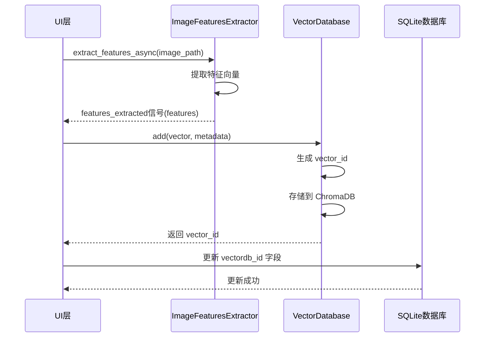

# 向量数据库模块设计文档

## 1. 概述

`vectordb` 模块是 StickerGenie 项目中用于存储和检索图像特征向量的核心组件。该模块基于 ChromaDB 实现，提供高效的向量相似度搜索能力，与 `image_features_extractor` 模块和 SQLite 数据库紧密集成。

### 1.1 设计目标

- **高性能搜索**: 利用 ChromaDB 的向量索引实现毫秒级相似度查询
- **数据一致性**: 与 SQLite 数据库保持同步，通过 `vectordb_id` 字段关联
- **易用性**: 提供简洁的 API，隐藏 ChromaDB 的复杂性
- **可扩展性**: 支持未来添加新的元数据字段和查询功能
- **可靠性**: 完善的错误处理和数据持久化机制

### 1.2 核心特性

- 基于 ChromaDB 的嵌入式向量存储（SQLite 后端）
- 支持 768 维特征向量（ViT-B/16 标准输出）
- 余弦相似度度量
- 元数据过滤和混合查询
- 与 SQLite 数据库的双向同步
- 批量操作支持

## 2. 模块结构设计

### 2.1 目录结构

```
src/stickerdb/vectordb/
├── __init__.py              # 模块入口，导出公共API
├── DESIGN.md                # 本设计文档
├── chroma_store.py          # ChromaDB 存储实现
├── config.py                # 配置参数
├── exceptions.py            # 自定义异常类
├── models.py                # 数据模型定义
└── utils.py                 # 辅助工具函数
```

### 2.2 职责划分

#### `__init__.py`
- 导出 `VectorDatabase` 主类
- 导出常用异常类型
- 导出数据模型类
- 提供模块版本信息

#### `chroma_store.py`
- 实现 `VectorDatabase` 主类
- 封装 ChromaDB 客户端操作
- 提供 CRUD 和查询接口
- 管理集合（collection）生命周期

#### `models.py`
- 定义 `VectorRecord` 数据类（向量记录）
- 定义 `SearchResult` 数据类（搜索结果）
- 定义 `VectorMetadata` 数据类（元数据）

#### `config.py`
- ChromaDB 配置参数
- 向量维度和距离度量配置
- 持久化路径配置
- 性能优化参数

#### `exceptions.py`
- `VectorDBError`: 基础异常类
- `VectorDimensionError`: 向量维度不匹配
- `RecordNotFoundError`: 记录不存在
- `DatabaseConnectionError`: 数据库连接失败
- `MetadataValidationError`: 元数据验证失败
- `DuplicateRecordError`: 记录已存在

#### `utils.py`
- 向量验证工具
- ID 生成工具
- 元数据序列化/反序列化
- 批量操作辅助函数

## 3. 数据模型设计

### 3.1 向量记录 (VectorRecord)

```python
@dataclass
class VectorRecord:
    """
    向量数据库记录
    
    属性:
        id: 向量记录的唯一标识符（UUID格式）
        vector: 特征向量（768维 float32 数组）
        metadata: 元数据字典
    """
    id: str                      # UUID 格式，如 "550e8400-e29b-41d4-a716-446655440000"
    vector: np.ndarray           # shape=(768,), dtype=np.float32
    metadata: 'VectorMetadata'   # 元数据对象
    
    def validate(self) -> bool:
        """验证记录的有效性"""
        pass
```

### 3.2 向量元数据 (VectorMetadata)

```python
@dataclass
class VectorMetadata:
    """
    向量记录的元数据
    
    属性:
        image_filename: 原始图像文件名
        model_hash: 特征提取模型的哈希值（用于判断是否需要重新生成）
        sqlite_id: SQLite数据库中对应的记录ID
        extraction_timestamp: 特征提取时间戳
        image_width: 图像宽度（像素）
        image_height: 图像高度（像素）
        custom_fields: 自定义扩展字段（JSON可序列化字典）
    """
    image_filename: str
    model_hash: str              # 如 "vit_b_16_v1_abc123def456"
    sqlite_id: int               # SQLite 中 DBStickerImage 的 id
    extraction_timestamp: float  # Unix 时间戳
    image_width: int
    image_height: int
    custom_fields: Optional[Dict[str, Any]] = None
    
    def to_dict(self) -> Dict[str, Any]:
        """转换为字典格式（用于ChromaDB存储）"""
        pass
    
    @classmethod
    def from_dict(cls, data: Dict[str, Any]) -> 'VectorMetadata':
        """从字典创建对象"""
        pass
```

### 3.3 搜索结果 (SearchResult)

```python
@dataclass
class SearchResult:
    """
    相似度搜索结果
    
    属性:
        id: 向量记录ID
        distance: 距离值（余弦距离，越小越相似）
        similarity: 相似度分数（0-1，越大越相似）
        metadata: 元数据对象
        vector: 特征向量（可选，节省内存）
    """
    id: str
    distance: float              # 余弦距离
    similarity: float            # 1 - distance（相似度）
    metadata: VectorMetadata
    vector: Optional[np.ndarray] = None
    
    @property
    def image_filename(self) -> str:
        """便捷访问图像文件名"""
        return self.metadata.image_filename
    
    @property
    def sqlite_id(self) -> int:
        """便捷访问SQLite ID"""
        return self.metadata.sqlite_id
```

## 4. API 接口设计

### 4.1 核心类：VectorDatabase

```python
class VectorDatabase:
    """
    向量数据库主接口类
    
    封装 ChromaDB 操作，提供简洁的向量存储和检索API。
    使用嵌入式模式（SQLite后端），数据持久化到本地磁盘。
    
    主要功能:
    - 向量的增删改查
    - 基于向量的相似度搜索
    - 元数据过滤查询
    - 批量操作支持
    - 与SQLite数据库的ID映射
    """
    
    def __init__(
        self,
        persist_directory: str = "./chroma_data",
        collection_name: str = "sticker_features",
        dimension: int = 768,
        distance_metric: str = "cosine"
    ):
        """
        初始化向量数据库
        
        参数:
            persist_directory: 数据持久化目录路径
            collection_name: 集合名称
            dimension: 向量维度（默认768，ViT-B/16）
            distance_metric: 距离度量方式（cosine/l2/ip）
        """
        pass
```

### 4.2 基本 CRUD 操作

#### 添加向量记录

```python
def add(
    self,
    vector: np.ndarray,
    metadata: VectorMetadata,
    record_id: Optional[str] = None
) -> str:
    """
    添加单个向量记录
    
    参数:
        vector: 特征向量（768维，float32）
        metadata: 元数据对象
        record_id: 可选的记录ID（如不提供则自动生成UUID）
        
    返回:
        记录ID（UUID格式）
        
    抛出:
        VectorDimensionError: 向量维度不匹配
        DuplicateRecordError: 记录ID已存在
        MetadataValidationError: 元数据验证失败
        
    示例:
        >>> metadata = VectorMetadata(
        ...     image_filename="cat.jpg",
        ...     model_hash="vit_b_16_v1",
        ...     sqlite_id=123,
        ...     extraction_timestamp=time.time(),
        ...     image_width=800,
        ...     image_height=600
        ... )
        >>> vector_id = db.add(features, metadata)
        >>> print(f"记录ID: {vector_id}")
    """
    pass

def add_batch(
    self,
    vectors: List[np.ndarray],
    metadatas: List[VectorMetadata],
    record_ids: Optional[List[str]] = None
) -> List[str]:
    """
    批量添加向量记录
    
    参数:
        vectors: 向量列表
        metadatas: 元数据列表
        record_ids: 可选的记录ID列表
        
    返回:
        记录ID列表
        
    注意:
        - 批量操作更高效，建议用于导入大量数据
        - 如果部分记录失败，会跳过并记录日志
    """
    pass
```

#### 删除向量记录

```python
def delete(self, record_id: str) -> bool:
    """
    删除指定ID的向量记录
    
    参数:
        record_id: 记录ID
        
    返回:
        True 如果删除成功，False 如果记录不存在
        
    示例:
        >>> if db.delete(vector_id):
        ...     print("删除成功")
    """
    pass

def delete_batch(self, record_ids: List[str]) -> Dict[str, bool]:
    """
    批量删除向量记录
    
    参数:
        record_ids: 记录ID列表
        
    返回:
        字典，键为记录ID，值为是否删除成功
    """
    pass

def delete_by_sqlite_id(self, sqlite_id: int) -> bool:
    """
    根据SQLite ID删除向量记录
    
    参数:
        sqlite_id: SQLite数据库中的记录ID
        
    返回:
        True 如果删除成功
        
    注意:
        内部先查询找到对应的向量ID，再执行删除
    """
    pass
```

#### 更新向量记录

```python
def update(
    self,
    record_id: str,
    vector: Optional[np.ndarray] = None,
    metadata: Optional[VectorMetadata] = None
) -> bool:
    """
    更新向量记录
    
    参数:
        record_id: 记录ID
        vector: 新的特征向量（可选）
        metadata: 新的元数据（可选）
        
    返回:
        True 如果更新成功
        
    抛出:
        RecordNotFoundError: 记录不存在
        VectorDimensionError: 向量维度不匹配
        
    注意:
        - vector 和 metadata 至少提供一个
        - 如果提供 metadata，会完全替换原有元数据
    """
    pass

def update_metadata(
    self,
    record_id: str,
    **metadata_fields
) -> bool:
    """
    部分更新元数据字段
    
    参数:
        record_id: 记录ID
        **metadata_fields: 要更新的元数据字段（键值对）
        
    返回:
        True 如果更新成功
        
    示例:
        >>> db.update_metadata(
        ...     vector_id,
        ...     model_hash="vit_b_16_v2",
        ...     extraction_timestamp=time.time()
        ... )
    """
    pass
```

#### 查询向量记录

```python
def get(self, record_id: str, include_vector: bool = True) -> Optional[VectorRecord]:
    """
    根据ID获取向量记录
    
    参数:
        record_id: 记录ID
        include_vector: 是否包含向量数据（默认True）
        
    返回:
        VectorRecord 对象，如果不存在则返回 None
        
    示例:
        >>> record = db.get(vector_id)
        >>> if record:
        ...     print(f"图像: {record.metadata.image_filename}")
    """
    pass

def get_by_sqlite_id(
    self,
    sqlite_id: int,
    include_vector: bool = True
) -> Optional[VectorRecord]:
    """
    根据SQLite ID获取向量记录
    
    参数:
        sqlite_id: SQLite数据库中的记录ID
        include_vector: 是否包含向量数据
        
    返回:
        VectorRecord 对象，如果不存在则返回 None
    """
    pass

def exists(self, record_id: str) -> bool:
    """
    检查记录是否存在
    
    参数:
        record_id: 记录ID
        
    返回:
        True 如果记录存在
    """
    pass
```

### 4.3 相似度查询

#### 基于向量ID查询

```python
def search_by_id(
    self,
    record_id: str,
    n_results: int = 10,
    include_self: bool = False,
    metadata_filter: Optional[Dict[str, Any]] = None
) -> List[SearchResult]:
    """
    根据向量ID查询最相似的记录
    
    参数:
        record_id: 查询的向量ID
        n_results: 返回结果数量
        include_self: 是否包含自身（默认False）
        metadata_filter: 元数据过滤条件（可选）
        
    返回:
        SearchResult 列表，按相似度降序排列
        
    抛出:
        RecordNotFoundError: 记录ID不存在
        
    示例:
        >>> results = db.search_by_id(vector_id, n_results=5)
        >>> for result in results:
        ...     print(f"{result.image_filename}: {result.similarity:.3f}")
    """
    pass
```

#### 基于向量查询

```python
def search_by_vector(
    self,
    query_vector: np.ndarray,
    n_results: int = 10,
    metadata_filter: Optional[Dict[str, Any]] = None
) -> List[SearchResult]:
    """
    根据输入向量查询最相似的记录
    
    参数:
        query_vector: 查询向量（768维）
        n_results: 返回结果数量
        metadata_filter: 元数据过滤条件
        
    返回:
        SearchResult 列表，按相似度降序排列
        
    抛出:
        VectorDimensionError: 向量维度不匹配
        
    示例:
        >>> # 使用 image_features_extractor 提取特征
        >>> features = extractor.extract_features_sync("new_image.jpg")
        >>> results = db.search_by_vector(features, n_results=10)
    """
    pass
```

#### 基于SQLite ID查询

```python
def search_by_sqlite_id(
    self,
    sqlite_id: int,
    n_results: int = 10,
    include_self: bool = False
) -> List[SearchResult]:
    """
    根据SQLite ID查询最相似的记录
    
    参数:
        sqlite_id: SQLite数据库中的记录ID
        n_results: 返回结果数量
        include_self: 是否包含自身
        
    返回:
        SearchResult 列表
        
    注意:
        内部先根据 sqlite_id 查找向量ID，再执行相似度搜索
    """
    pass
```

#### 元数据过滤查询

```python
def query_by_metadata(
    self,
    metadata_filter: Dict[str, Any],
    n_results: Optional[int] = None
) -> List[VectorRecord]:
    """
    根据元数据条件查询记录
    
    参数:
        metadata_filter: 元数据过滤条件
        n_results: 返回结果数量限制（可选）
        
    返回:
        VectorRecord 列表
        
    示例:
        >>> # 查询特定模型哈希的所有记录
        >>> records = db.query_by_metadata({
        ...     "model_hash": "vit_b_16_v1"
        ... })
        
        >>> # 查询特定尺寸范围的图像
        >>> records = db.query_by_metadata({
        ...     "image_width": {"$gte": 800},
        ...     "image_height": {"$gte": 600}
        ... })
    """
    pass
```

### 4.4 集合管理

```python
def count(self) -> int:
    """
    获取集合中的记录总数
    
    返回:
        记录总数
    """
    pass

def clear(self) -> bool:
    """
    清空集合中的所有记录
    
    返回:
        True 如果清空成功
        
    警告:
        此操作不可逆！会删除所有向量数据
    """
    pass

def get_collection_info(self) -> Dict[str, Any]:
    """
    获取集合信息
    
    返回:
        包含集合统计信息的字典：
        - name: 集合名称
        - count: 记录总数
        - dimension: 向量维度
        - distance_metric: 距离度量
        - metadata_schema: 元数据模式
    """
    pass
```

### 4.5 辅助功能

```python
def verify_integrity(self) -> Dict[str, Any]:
    """
    验证数据完整性
    
    检查项:
    - 向量维度一致性
    - 元数据完整性
    - 重复ID检查
    
    返回:
        验证报告字典
    """
    pass

def export_to_numpy(
    self,
    output_path: str,
    include_metadata: bool = True
) -> None:
    """
    导出向量数据到NumPy格式
    
    参数:
        output_path: 输出文件路径（.npz格式）
        include_metadata: 是否包含元数据
        
    注意:
        导出格式:
        - vectors: (N, 768) 数组
        - ids: (N,) 数组
        - metadata: 元数据列表（如果 include_metadata=True）
    """
    pass

def import_from_numpy(
    self,
    input_path: str,
    overwrite: bool = False
) -> int:
    """
    从NumPy格式导入向量数据
    
    参数:
        input_path: 输入文件路径（.npz格式）
        overwrite: 是否覆盖已存在的记录
        
    返回:
        导入的记录数量
    """
    pass
```

## 5. ChromaDB 配置设计

### 5.1 基本配置

```python
# config.py

# ============================================================================
# ChromaDB 配置
# ============================================================================

# 默认持久化目录（相对于仓库根目录）
DEFAULT_PERSIST_DIRECTORY = ".stickergenie/chroma_data"

# 默认集合名称
DEFAULT_COLLECTION_NAME = "sticker_features"

# 向量维度（ViT-B/16 标准输出）
VECTOR_DIMENSION = 768

# 向量数据类型
VECTOR_DTYPE = np.float32

# 距离度量方式
# 可选: "cosine"(余弦距离), "l2"(欧氏距离), "ip"(内积)
DISTANCE_METRIC = "cosine"

# ============================================================================
# 性能优化配置
# ============================================================================

# 批量操作的批次大小
BATCH_SIZE = 100

# ChromaDB 客户端设置
CHROMA_CLIENT_SETTINGS = {
    "anonymized_telemetry": False,  # 禁用匿名遥测
    "allow_reset": True,             # 允许重置数据库（仅开发环境）
}

# ============================================================================
# 元数据模式
# ============================================================================

# 必需的元数据字段
REQUIRED_METADATA_FIELDS = [
    "image_filename",
    "model_hash",
    "sqlite_id",
    "extraction_timestamp",
    "image_width",
    "image_height",
]

# 元数据字段类型映射
METADATA_FIELD_TYPES = {
    "image_filename": str,
    "model_hash": str,
    "sqlite_id": int,
    "extraction_timestamp": float,
    "image_width": int,
    "image_height": int,
}

# ============================================================================
# 索引配置
# ============================================================================

# HNSW 索引参数（ChromaDB 默认使用 HNSW）
HNSW_SPACE = "cosine"        # 距离度量空间
HNSW_CONSTRUCTION_EF = 100   # 构建时的 ef 参数
HNSW_SEARCH_EF = 100         # 搜索时的 ef 参数
HNSW_M = 16                  # 每个节点的最大连接数
```

### 5.2 集合配置

```python
def get_collection_metadata() -> Dict[str, Any]:
    """
    获取集合元数据配置
    
    返回:
        ChromaDB 集合元数据字典
    """
    return {
        "hnsw:space": HNSW_SPACE,
        "hnsw:construction_ef": HNSW_CONSTRUCTION_EF,
        "hnsw:search_ef": HNSW_SEARCH_EF,
        "hnsw:M": HNSW_M,
    }
```

### 5.3 持久化路径设计

向量数据库持久化到仓库的 `.stickergenie/` 目录下：

```
<仓库根目录>/
└── .stickergenie/
    ├── std_data.db              # SQLite 数据库
    └── chroma_data/             # ChromaDB 持久化目录
        ├── chroma.sqlite3       # ChromaDB 的 SQLite 存储
        └── <collection_uuid>/   # 集合数据
            ├── data_level0.bin
            ├── header.bin
            ├── index_metadata.pickle
            └── link_lists.bin
```

## 6. 异常处理设计

### 6.1 异常层次

```python
# exceptions.py

class VectorDBError(Exception):
    """向量数据库基础异常类"""
    pass

class VectorDimensionError(VectorDBError):
    """
    向量维度不匹配异常
    
    当输入的向量维度与配置的维度不一致时抛出
    """
    def __init__(self, expected: int, actual: int):
        self.expected = expected
        self.actual = actual
        super().__init__(
            f"向量维度不匹配: 期望 {expected} 维，实际 {actual} 维"
        )

class RecordNotFoundError(VectorDBError):
    """
    记录不存在异常
    
    当查询的记录ID不存在时抛出
    """
    def __init__(self, record_id: str):
        self.record_id = record_id
        super().__init__(f"记录不存在: {record_id}")

class DatabaseConnectionError(VectorDBError):
    """
    数据库连接失败异常
    
    当无法连接到ChromaDB时抛出
    """
    def __init__(self, reason: str):
        self.reason = reason
        super().__init__(f"数据库连接失败: {reason}")

class MetadataValidationError(VectorDBError):
    """
    元数据验证失败异常
    
    当元数据字段缺失或类型不匹配时抛出
    """
    def __init__(self, field: str, reason: str):
        self.field = field
        self.reason = reason
        super().__init__(f"元数据字段 '{field}' 验证失败: {reason}")

class DuplicateRecordError(VectorDBError):
    """
    记录已存在异常
    
    当尝试添加已存在的记录ID时抛出
    """
    def __init__(self, record_id: str):
        self.record_id = record_id
        super().__init__(f"记录已存在: {record_id}")

class CollectionNotFoundError(VectorDBError):
    """
    集合不存在异常
    
    当指定的集合不存在时抛出
    """
    def __init__(self, collection_name: str):
        self.collection_name = collection_name
        super().__init__(f"集合不存在: {collection_name}")
```

### 6.2 错误处理策略

| 错误场景 | 处理方式 | 用户通知 |
|---------|---------|---------|
| 向量维度不匹配 | 抛出 `VectorDimensionError` | 立即返回错误信息 |
| 记录ID不存在 | 抛出 `RecordNotFoundError` | 提示用户记录不存在 |
| 数据库连接失败 | 抛出 `DatabaseConnectionError` | 提示检查数据库配置 |
| 元数据验证失败 | 抛出 `MetadataValidationError` | 提示缺失或错误的字段 |
| 重复ID | 抛出 `DuplicateRecordError` | 提示使用不同的ID或更新 |
| 批量操作部分失败 | 记录日志，跳过失败项 | 返回成功和失败的记录列表 |
| ChromaDB内部错误 | 包装为 `VectorDBError` | 记录详细日志，提示联系支持 |

### 6.3 日志记录

```python
import logging

logger = logging.getLogger(__name__)

# 使用示例
logger.info(f"添加向量记录: {record_id}")
logger.warning(f"记录已存在，跳过: {record_id}")
logger.error(f"向量维度验证失败: {error}", exc_info=True)
logger.debug(f"搜索结果: {len(results)} 条记录")
```

## 7. 与现有模块的集成设计

### 7.1 与 image_features_extractor 的集成

#### 工作流程



#### 集成示例代码

```python
from image_features_extractor import ImageFeaturesExtractor
from stickerdb.vectordb import VectorDatabase, VectorMetadata

class StickerProcessor:
    """贴纸处理器，集成特征提取和向量存储"""
    
    def __init__(self):
        self.extractor = ImageFeaturesExtractor(num_workers=2)
        self.vectordb = VectorDatabase()
        self.extractor.start()
    
    def process_image(self, image_path: str, sqlite_id: int) -> str:
        """
        处理图像：提取特征并存储到向量数据库
        
        参数:
            image_path: 图像文件路径
            sqlite_id: SQLite数据库中的记录ID
            
        返回:
            向量记录ID
        """
        # 1. 提取特征
        features = self.extractor.extract_features_sync(image_path)
        
        # 2. 获取图像信息
        from PIL import Image
        img = Image.open(image_path)
        width, height = img.size
        
        # 3. 创建元数据
        metadata = VectorMetadata(
            image_filename=Path(image_path).name,
            model_hash="vit_b_16_v1",  # 从配置或模型获取
            sqlite_id=sqlite_id,
            extraction_timestamp=time.time(),
            image_width=width,
            image_height=height
        )
        
        # 4. 存储到向量数据库
        vector_id = self.vectordb.add(features, metadata)
        
        # 5. 更新SQLite数据库（由调用者完成）
        return vector_id
    
    def __del__(self):
        self.extractor.stop()
```

### 7.2 与 DBStickerImage 的集成

#### vectordb_id 字段的使用

1. **添加新图像时**:
   ```python
   # 1. 创建 SQLite 记录
   sticker = DBStickerImage(...)
   session.add(sticker)
   session.flush()  # 获取 ID
   
   # 2. 提取特征并添加到向量数据库
   vector_id = processor.process_image(image_path, sticker.id)
   
   # 3. 更新 vectordb_id
   sticker.vectordb_id = vector_id
   session.commit()
   ```

2. **查询相似图像时**:
   ```python
   # 1. 根据 SQLite ID 查询相似向量
   results = vectordb.search_by_sqlite_id(sticker.id, n_results=10)
   
   # 2. 根据向量 ID 反查 SQLite 记录
   for result in results:
       similar_sticker = session.query(DBStickerImage).filter_by(
           id=result.sqlite_id
       ).first()
   ```

3. **删除图像时**:
   ```python
   # 1. 删除 SQLite 记录
   vector_id = sticker.vectordb_id
   session.delete(sticker)
   
   # 2. 删除向量记录
   if vector_id:
       vectordb.delete(vector_id)
   
   session.commit()
   ```

#### 数据同步策略

- **正向同步**: SQLite → VectorDB
  * 添加新记录时自动创建向量记录
  * 删除时同步删除向量记录
  
- **反向同步**: VectorDB → SQLite
  * 通过 `sqlite_id` 元数据字段关联
  * 验证数据一致性时检查双向引用

### 7.3 模型哈希机制

#### 用途
- 判断特征是否需要重新生成
- 支持模型版本升级
- 追踪特征提取来源

#### 实现方案

```python
def get_model_hash() -> str:
    """
    获取当前模型的哈希值
    
    返回:
        模型哈希字符串，如 "vit_b_16_v1_abc123"
    """
    import hashlib
    
    model_path = "vit_b_16_features.onnx"
    
    # 计算模型文件的 SHA256 哈希
    with open(model_path, "rb") as f:
        file_hash = hashlib.sha256(f.read()).hexdigest()[:12]
    
    # 组合版本信息
    model_name = "vit_b_16"
    version = "v1"
    
    return f"{model_name}_{version}_{file_hash}"

# 使用示例
current_hash = get_model_hash()

# 检查是否需要重新生成特征
record = vectordb.get_by_sqlite_id(sticker_id)
if record and record.metadata.model_hash != current_hash:
    # 模型已更新，需要重新提取特征
    new_features = extractor.extract_features_sync(image_path)
    vectordb.update(record.id, vector=new_features)
    vectordb.update_metadata(record.id, model_hash=current_hash)
```

## 8. 性能优化建议

### 8.1 批量操作优化

```python
# 不推荐：逐个添加
for image_path in image_paths:
    features = extractor.extract_features_sync(image_path)
    vectordb.add(features, metadata)

# 推荐：批量添加
features_list = []
metadata_list = []

for image_path in image_paths:
    features = extractor.extract_features_sync(image_path)
    features_list.append(features)
    metadata_list.append(create_metadata(image_path))

vectordb.add_batch(features_list, metadata_list)
```

### 8.2 查询优化

- **使用元数据过滤**: 减少搜索空间
- **控制返回数量**: 不要请求过多结果
- **缓存热点数据**: 缓存常用的查询结果
- **异步查询**: 在后台线程中执行查询

### 8.3 索引优化

```python
# HNSW 参数调优
# - ef_construction: 影响索引质量和构建时间
# - M: 影响召回率和查询速度
# - ef_search: 影响查询精度和速度

# 高精度配置（慢但准确）
config = {
    "hnsw:construction_ef": 200,
    "hnsw:M": 32,
    "hnsw:search_ef": 200
}

# 高速度配置（快但可能牺牲精度）
config = {
    "hnsw:construction_ef": 50,
    "hnsw:M": 8,
    "hnsw:search_ef": 50
}
```

### 8.4 内存优化

- **不包含向量**: 查询时设置 `include_vector=False`
- **分批处理**: 大量数据分批处理，避免内存溢出
- **定期清理**: 删除过期或无用的向量记录

## 9. 使用示例

### 9.1 基本使用流程

```python
from stickerdb.vectordb import VectorDatabase, VectorMetadata
from image_features_extractor import ImageFeaturesExtractor
import numpy as np

# 1. 初始化
vectordb = VectorDatabase(
    persist_directory=".stickergenie/chroma_data",
    collection_name="sticker_features"
)

extractor = ImageFeaturesExtractor(num_workers=2)
extractor.start()

# 2. 添加向量
features = extractor.extract_features_sync("cat.jpg")
metadata = VectorMetadata(
    image_filename="cat.jpg",
    model_hash="vit_b_16_v1",
    sqlite_id=1,
    extraction_timestamp=time.time(),
    image_width=800,
    image_height=600
)

vector_id = vectordb.add(features, metadata)
print(f"向量ID: {vector_id}")

# 3. 搜索相似图像
results = vectordb.search_by_id(vector_id, n_results=5)
for i, result in enumerate(results, 1):
    print(f"{i}. {result.image_filename} - 相似度: {result.similarity:.3f}")

# 4. 根据新图像搜索
new_features = extractor.extract_features_sync("dog.jpg")
results = vectordb.search_by_vector(new_features, n_results=10)

# 5. 清理
extractor.stop()
```

### 9.2 批量导入

```python
from pathlib import Path

image_dir = Path("images/")
image_files = list(image_dir.glob("*.jpg"))

vectors = []
metadatas = []

for img_path in image_files:
    # 提取特征
    features = extractor.extract_features_sync(str(img_path))
    vectors.append(features)
    
    # 创建元数据
    img = Image.open(img_path)
    metadata = VectorMetadata(
        image_filename=img_path.name,
        model_hash="vit_b_16_v1",
        sqlite_id=0,  # 临时ID，后续更新
        extraction_timestamp=time.time(),
        image_width=img.size[0],
        image_height=img.size[1]
    )
    metadatas.append(metadata)

# 批量添加
vector_ids = vectordb.add_batch(vectors, metadatas)
print(f"成功导入 {len(vector_ids)} 条记录")
```

### 9.3 与SQLite集成

```python
from sqlalchemy.orm import Session
from stickerdb.v1.db_classes import DBStickerImage

def add_sticker_with_vector(
    session: Session,
    image_path: str,
    extractor: ImageFeaturesExtractor,
    vectordb: VectorDatabase
) -> DBStickerImage:
    """添加贴纸及其向量"""
    
    # 1. 创建 SQLite 记录
    img = Image.open(image_path)
    sticker = DBStickerImage(
        original_file_name=Path(image_path).name,
        relative_path=image_path,
        file_size=Path(image_path).stat().st_size,
        hash=calculate_hash(image_path),
        imported_at=datetime.now(),
        modification_date=datetime.now(),
        size_width=img.size[0],
        size_height=img.size[1],
        vectordb_id=None  # 稍后更新
    )
    session.add(sticker)
    session.flush()  # 获取自动生成的 ID
    
    # 2. 提取特征
    features = extractor.extract_features_sync(image_path)
    
    # 3. 添加到向量数据库
    metadata = VectorMetadata(
        image_filename=sticker.original_file_name,
        model_hash=get_model_hash(),
        sqlite_id=sticker.id,
        extraction_timestamp=time.time(),
        image_width=sticker.size_width,
        image_height=sticker.size_height
    )
    vector_id = vectordb.add(features, metadata)
    
    # 4. 更新 vectordb_id
    sticker.vectordb_id = vector_id
    session.commit()
    
    return sticker

def find_similar_stickers(
    session: Session,
    sticker_id: int,
    vectordb: VectorDatabase,
    n_results: int = 10
) -> List[DBStickerImage]:
    """查找相似贴纸"""
    
    # 1. 查询向量数据库
    results = vectordb.search_by_sqlite_id(sticker_id, n_results=n_results)
    
    # 2. 根据 sqlite_id 查询 SQLite 记录
    similar_stickers = []
    for result in results:
        sticker = session.query(DBStickerImage).filter_by(
            id=result.sqlite_id
        ).first()
        if sticker:
            similar_stickers.append(sticker)
    
    return similar_stickers
```

## 10. 测试策略

### 10.1 单元测试

```python
# tests/test_vectordb.py

def test_add_single_vector():
    """测试添加单个向量"""
    db = VectorDatabase(persist_directory=":memory:")
    vector = np.random.rand(768).astype(np.float32)
    metadata = create_test_metadata()
    
    vector_id = db.add(vector, metadata)
    assert vector_id is not None
    assert db.exists(vector_id)

def test_search_by_vector():
    """测试向量搜索"""
    db = VectorDatabase(persist_directory=":memory:")
    # 添加测试数据
    vectors = [np.random.rand(768).astype(np.float32) for _ in range(10)]
    for v in vectors:
        db.add(v, create_test_metadata())
    
    # 搜索
    results = db.search_by_vector(vectors[0], n_results=5)
    assert len(results) == 5
    assert results[0].similarity > 0.9  # 应该找到自己

def test_metadata_validation():
    """测试元数据验证"""
    db = VectorDatabase()
    vector = np.random.rand(768).astype(np.float32)
    
    # 缺少必需字段
    invalid_metadata = VectorMetadata(
        image_filename="test.jpg",
        # 缺少其他必需字段
    )
    
    with pytest.raises(MetadataValidationError):
        db.add(vector, invalid_metadata)
```

### 10.2 集成测试

```python
def test_integration_with_extractor():
    """测试与特征提取器的集成"""
    extractor = ImageFeaturesExtractor()
    vectordb = VectorDatabase()
    
    extractor.start()
    
    # 提取特征并存储
    features = extractor.extract_features_sync("test_image.jpg")
    metadata = create_metadata_from_image("test_image.jpg")
    vector_id = vectordb.add(features, metadata)
    
    # 搜索
    results = vectordb.search_by_id(vector_id, n_results=1)
    assert len(results) == 1
    
    extractor.stop()

def test_sqlite_integration():
    """测试与SQLite的集成"""
    from sqlalchemy import create_engine
    from sqlalchemy.orm import Session
    
    engine = create_engine("sqlite:///:memory:")
    Base.metadata.create_all(engine)
    session = Session(engine)
    
    vectordb = VectorDatabase()
    
    # 添加贴纸
    sticker = add_sticker_with_vector(
        session, "test.jpg", extractor, vectordb
    )
    
    # 验证关联
    assert sticker.vectordb_id is not None
    record = vectordb.get(sticker.vectordb_id)
    assert record.metadata.sqlite_id == sticker.id
```

### 10.3 性能测试

```python
def test_batch_performance():
    """测试批量操作性能"""
    import time
    
    db = VectorDatabase()
    n = 1000
    vectors = [np.random.rand(768).astype(np.float32) for _ in range(n)]
    metadatas = [create_test_metadata() for _ in range(n)]
    
    start = time.time()
    db.add_batch(vectors, metadatas)
    duration = time.time() - start
    
    print(f"批量添加 {n} 条记录耗时: {duration:.2f}秒")
    assert duration < 10.0  # 应该在10秒内完成

def test_search_performance():
    """测试搜索性能"""
    # 添加大量数据
    db = prepare_large_database(size=10000)
    
    query_vector = np.random.rand(768).astype(np.float32)
    
    start = time.time()
    results = db.search_by_vector(query_vector, n_results=100)
    duration = time.time() - start
    
    print(f"搜索耗时: {duration*1000:.2f}毫秒")
    assert duration < 0.1  # 应该在100ms内完成
```

## 11. 依赖项

### 11.1 必需依赖

```txt
# 向量数据库
chromadb>=0.4.0           # ChromaDB向量数据库

# 已有依赖（来自其他模块）
numpy>=1.24.0             # 向量操作
sqlalchemy>=2.0.0         # SQLite ORM
```

### 11.2 可选依赖

```txt
# 性能优化
hnswlib>=0.7.0           # 更快的HNSW实现（ChromaDB可能内置）
```

## 12. 实现优先级

### Phase 1: 核心功能 (MVP)
- [ ] 基本的 VectorDatabase 类
- [ ] 数据模型定义（VectorRecord, VectorMetadata）
- [ ] CRUD 操作（add, delete, get）
- [ ] 基于向量的相似度搜索
- [ ] 基本配置和异常处理

### Phase 2: SQLite 集成
- [ ] vectordb_id 关联机制
- [ ] 基于 sqlite_id 的查询接口
- [ ] 数据同步工具
- [ ] 模型哈希机制

### Phase 3: 高级功能
- [ ] 批量操作优化
- [ ] 元数据过滤查询
- [ ] 数据导入/导出
- [ ] 完整性验证

### Phase 4: 优化和测试
- [ ] 性能优化
- [ ] 完整的单元测试
- [ ] 集成测试
- [ ] 使用文档和示例

## 13. 未来扩展方向

### 13.1 功能扩展
- **多模态支持**: 支持文本、音频等其他特征
- **动态索引**: 支持在线添加数据而不重建索引
- **分布式部署**: 支持多机器扩展
- **版本管理**: 支持向量数据的版本控制

### 13.2 性能优化
- **GPU加速**: 利用GPU加速向量运算
- **压缩存储**: 使用向量量化减少存储空间
- **智能缓存**: 基于访问模式的智能缓存
- **并行查询**: 支持多线程/多进程并行查询

### 13.3 易用性增强
- **可视化工具**: 向量空间可视化
- **自动备份**: 定期自动备份向量数据
- **监控面板**: 实时监控数据库状态
- **迁移工具**: 简化数据迁移和升级

## 14. 关键设计决策总结

### 14.1 为什么选择 ChromaDB？

- **嵌入式部署**: 无需额外服务，简化部署
- **SQLite 后端**: 与现有 SQLite 数据库技术栈一致
- **成熟稳定**: 经过充分测试，社区活跃
- **简单易用**: API 设计简洁，学习曲线平缓
- **性能优异**: HNSW 索引提供优秀的查询性能

### 14.2 为什么使用 UUID 作为向量ID？

- **全局唯一**: 避免ID冲突
- **无需中心化**: 分布式环境友好
- **可追踪**: 便于调试和日志记录
- **独立性**: 与SQLite ID解耦，灵活性更高

### 14.3 为什么设计独立的元数据模型？

- **类型安全**: 使用 dataclass 提供类型检查
- **验证逻辑**: 集中管理元数据验证
- **扩展性**: 易于添加新字段
- **序列化**: 统一的序列化/反序列化逻辑

### 14.4 为什么保留 sqlite_id 字段？

- **双向关联**: 方便从任意方向查询
- **数据一致性**: 便于验证和同步
- **查询优化**: 避免多次查询
- **灵活性**: 支持复杂的关联查询

### 14.5 为什么使用余弦距离？

- **归一化不变**: 对向量长度不敏感
- **语义相似度**: 更符合图像相似度的定义
- **范围固定**: 距离范围在 [0, 2]，便于阈值设置
- **计算高效**: ChromaDB 对余弦距离有优化

---

**文档版本**: 1.0  
**创建日期**: 2025-01-15  
**最后更新**: 2025-01-15  
**作者**: Roo (Architect Mode)